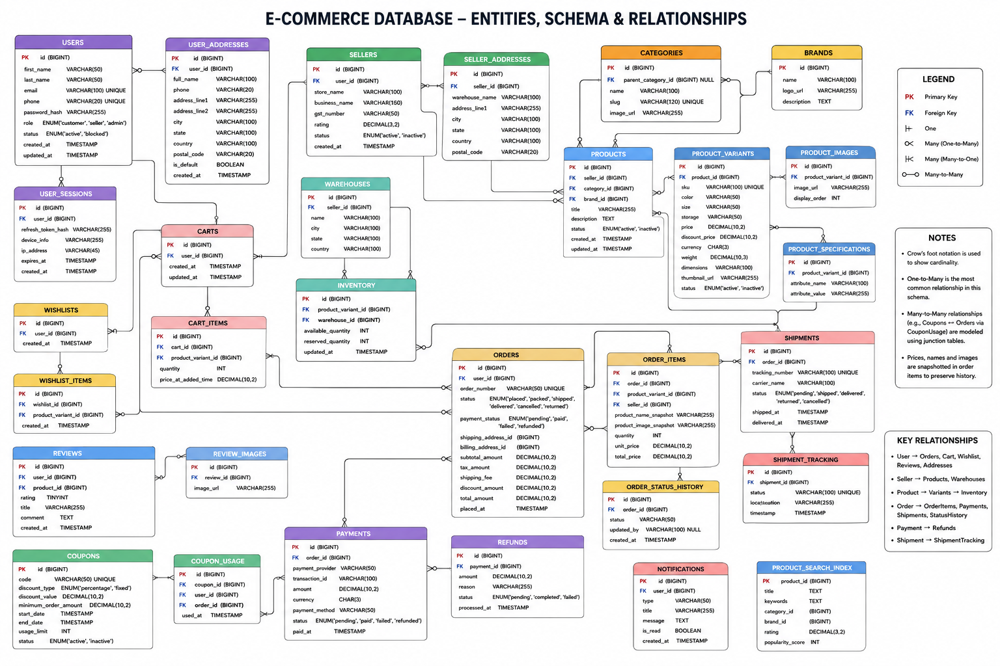
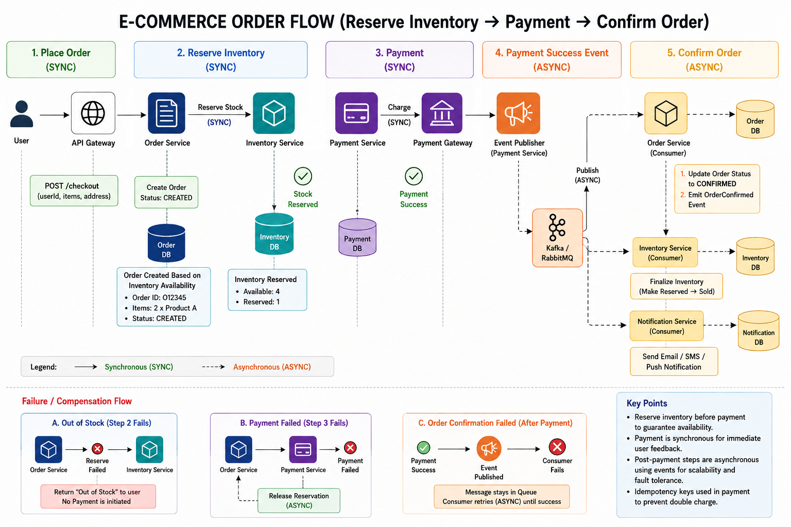

5. # Design an E-commerce Platform like Amazon

Functional Requirements:

* Allow sellers to list products with details like title, description, price, images, and specifications.
* Users can add products to a shopping cart and wishlist.
* Users can search for products, categories, and brands based on keywords
* Users can place orders for one or multiple products.
* Users can rate and review products they have purchased.

Non-Functional Requirements:

* High Scalability: The platform should handle millions of users, products, and transactions simultaneously.
* High Availability: The service should be up 99.9% of the time.
* Low latency for page load times, search queries, and checkout processes.
* High Durability: All critical data (user data, product listings, orders) is stored with high durability.

Expected interview discussion points:

# How would you design an e-commerce platform like Amazon that supports millions of users and products?

An e-commerce platform like Amazon is a highly distributed system that handles millions of users, products, searches, payments, and orders concurrently. The primary challenge is not just serving traffic, but maintaining consistency for inventory and orders while keeping latency extremely low.

The platform must support:

* Product catalog management
* Search and discovery
* Shopping cart and wishlist
* Checkout and payment
* Inventory management
* Order processing
* Ratings and reviews
* Recommendation systems
* Seller management
* Notification systems

The architecture must scale horizontally because vertical scaling alone becomes insufficient at Amazon-scale traffic.

A classical large-scale architecture usually separates the system into independently scalable microservices connected through APIs, asynchronous queues, and event-driven workflows.

A typical production architecture looks like this:

```text
Clients (Web/Mobile)
        |
API Gateway / Load Balancer
        |
----------------------------------------------------
|        |         |         |         |           |
User   Product   Search    Cart     Order      Inventory
Svc    Service   Service   Service   Service    Service
|         |         |         |          |
----------------------------------------------------
              Event Bus / Kafka
----------------------------------------------------
|          |             |             |           |
Payment  Notification  Analytics  Recommendation  Review
Service    Service     Pipeline      Engine       Service
```

The API Gateway handles:

* Authentication
* Rate limiting
* Request routing
* SSL termination
* Request aggregation

A CDN is heavily used for:

* Product images
* Static assets
* Cached product pages

This reduces latency globally and decreases load on backend services.

For persistence, polyglot storage is typically used instead of one single database.

Example:

* PostgreSQL/MySQL → Orders and payments
* DynamoDB/Cassandra → Product catalog and carts
* Elasticsearch/OpenSearch → Product search
* Redis → Caching and sessions
* Kafka → Event streaming and asynchronous workflows
* Object Storage (S3) → Product images

The reason multiple databases are used is because each workload has different access patterns.

Orders require strong consistency and ACID guarantees, while product catalogs require massive horizontal scalability and high read throughput.

The Product Service is one of the largest systems because product catalogs can contain hundreds of millions of SKUs.

A classical Product Object may look like this:

```json
{
  "product_id": "P12345",
  "title": "Apple iPhone 15 Pro",
  "description": "Latest Apple smartphone",
  "brand": "Apple",
  "category": "Mobiles",
  "price": 1399,
  "currency": "USD",
  "inventory_count": 1200,
  "seller_id": "S456",
  "rating": 4.7,
  "review_count": 15421,
  "specifications": {
    "ram": "8GB",
    "storage": "256GB",
    "color": "Black Titanium"
  },
  "images": [
    "img1.jpg",
    "img2.jpg"
  ],
  "created_at": "2026-05-23T10:00:00Z"
}
```

At Amazon scale, the Product Service becomes read-heavy. Reads are several orders of magnitude higher than writes.

Because of this:

* Product data is heavily cached in Redis
* Frequently accessed products may also be cached at CDN edge layers
* Product replicas are geographically distributed

The Search Service is typically separated from the Product Database because relational databases perform poorly for fuzzy text searches and relevance ranking.

Industry-standard systems use Elasticsearch or OpenSearch.

Search indexing is asynchronous and event-driven.

Whenever a product is created or updated:

1. Product Service writes to primary database
2. Product Service publishes ProductUpdated event to Kafka
3. Search Indexer consumes event
4. Elasticsearch index gets updated

This architecture improves scalability because search indexing becomes decoupled from the write path.

However, this introduces eventual consistency.

For example:

* Seller changes product price
* Database updates immediately
* Search index updates after a few seconds

Users may temporarily see stale search results.

This tradeoff is accepted because synchronous indexing would drastically increase write latency and reduce system throughput.

A typical Elasticsearch mapping may look like this:

```json
{
  "mappings": {
    "properties": {
      "product_id": {
        "type": "keyword"
      },
      "title": {
        "type": "text",
        "analyzer": "standard"
      },
      "description": {
        "type": "text"
      },
      "brand": {
        "type": "keyword"
      },
      "category": {
        "type": "keyword"
      },
      "price": {
        "type": "float"
      },
      "rating": {
        "type": "float"
      },
      "inventory_count": {
        "type": "integer"
      },
      "created_at": {
        "type": "date"
      }
    }
  }
}
```

Important indexing strategy decisions:

* `keyword` fields are used for exact filtering and aggregations
* `text` fields are tokenized for full-text search
* Numeric fields support sorting and range queries
* Frequently filtered fields like brand/category are indexed separately

Exact indexing strategy on Product Object:

* title → Full-text indexed
* description → Full-text indexed
* category → Filter indexed
* brand → Filter indexed
* price → Range indexed
* rating → Sorting indexed
* inventory_count → Availability filtering
* specifications → Dynamic nested indexing

Search relevance ranking is extremely important in e-commerce systems.

Ranking factors usually include:

* Text relevance score (BM25)
* Click-through rate
* Conversion rate
* Product popularity
* Purchase history
* Inventory availability
* Seller quality
* Sponsored ranking boosts
* Recency
* Personalized recommendations

For example:
If two iPhone listings match equally well, the system may rank higher:

* Products with better conversion rate
* Products with faster delivery
* Products with higher ratings
* Products currently in stock

The Cart Service is usually implemented using Redis or DynamoDB because carts are highly write-intensive and require very low latency.

Cart data is temporary and does not need strict relational consistency.

Wishlist systems are similar but can tolerate even higher eventual consistency.

The Order Service is one of the most critical services.

Order systems generally use relational databases because:

* Transactions are critical
* Financial correctness is mandatory
* ACID guarantees are needed

A typical checkout flow:

```text
1. User clicks Buy
2. Inventory reserved
3. Payment initiated
4. Order created
5. Payment success confirmed
6. Inventory permanently deducted
7. Shipment initiated
```

The most difficult engineering problem is inventory consistency during flash sales.

Suppose:

* 10 items remaining
* 10,000 users attempt checkout simultaneously

Without proper coordination:

* Overselling occurs

Industry systems typically use inventory reservation.

Classical approach:

* Inventory stored in strongly consistent database
* Atomic decrement operation used
* Reservation timeout applied

Example:

```text
Available inventory = 10

User A reserves 1 item
Inventory becomes 9 immediately

If payment fails or timeout occurs:
Inventory released back
```

Techniques commonly used:

* Optimistic locking
* Distributed locks
* Atomic counters in Redis
* Reservation queues

A common scalable implementation:

```text
Checkout Request
      |
Inventory Service
      |
Atomic Reservation
      |
Kafka Event
      |
Order Processing Pipeline
```

During flash sales, many systems introduce virtual waiting queues.

This protects backend systems from sudden spikes.

Example:

* 1 million users enter flash sale
* Queue system throttles requests
* Only manageable batch proceeds to checkout

This prevents database overload.

The Inventory Service must prioritize consistency over availability because overselling creates financial and customer trust problems.

CAP theorem tradeoff:

* Inventory systems usually prefer CP
* Product catalog systems prefer AP

Payments should be asynchronous.

Why?

External payment gateways are slow and unreliable.

Instead of blocking checkout synchronously:

* Order created in PENDING state
* Payment service processes asynchronously
* Kafka events update order state

Example order states:

```text
PENDING_PAYMENT
PAYMENT_SUCCESS
PAYMENT_FAILED
SHIPPED
DELIVERED
CANCELLED
```

This architecture improves resiliency.

If payment gateway is temporarily unavailable:

* Orders can be retried
* System remains operational

Event-driven architecture is heavily used in large-scale e-commerce systems.

Example events:

* OrderCreated
* PaymentCompleted
* InventoryReserved
* ProductUpdated
* ReviewSubmitted

Benefits:

* Loose coupling
* Independent scalability
* Retry support
* Failure isolation

For example:
When an order is placed:

* Notification Service sends email
* Recommendation system updates user profile
* Analytics pipeline processes metrics
* Shipment service starts fulfillment

All independently consume Kafka events.

This avoids tight synchronous dependencies.

Without event-driven design:

* Checkout latency increases
* Cascading failures become common

Caching is critical for scalability.

Common cache layers:

* CDN → Images/static assets
* Redis → Product pages
* Query cache → Search responses
* Session cache → Authentication

Hot products are aggressively cached.

However, cache invalidation becomes difficult.

Example:

* Seller changes product price
* Redis cache still contains stale value

Solutions:

* TTL expiration
* Write-through cache
* Cache invalidation events

Database scaling strategies:

* Read replicas for scaling reads
* Sharding for horizontal scaling
* Partitioning orders by user_id or region

Example:

```text
Orders_US
Orders_Europe
Orders_Asia
```

This reduces shard size and improves performance.

Reviews and ratings are eventually consistent systems.

When a review is submitted:

* Review stored immediately
* Aggregate rating updated asynchronously

Example:

```text
Average rating recalculated by background workers
```

This reduces write contention on Product tables.

Monitoring and observability are mandatory.

Industry systems use:

* Prometheus
* Grafana
* ELK Stack
* Distributed tracing
* Centralized logging

Critical metrics:

* Checkout latency
* Payment failure rate
* Inventory reservation failures
* Search latency
* Cart abandonment rate

High availability is achieved using:

* Multi-region deployment
* Active-active architecture
* Database replication
* Load balancing
* Auto-scaling

Durability is ensured through:

* Replicated storage
* WAL logs
* Backup systems
* Cross-region replication

A production-level e-commerce platform is fundamentally a distributed event-driven system optimized for:

* Massive read scalability
* Low latency
* Inventory correctness
* Fault isolation
* Eventual consistency where acceptable
* Strong consistency where financially necessary

The most important interview discussion points are usually:

* Inventory consistency
* Search architecture
* Event-driven workflows
* Scalability bottlenecks
* Database choices
* Caching strategy
* Flash sale handling
* Tradeoffs between consistency and availability

---


# Designing Search Functionality for Millions of Products

The search system is one of the most critical components in an e-commerce platform because users primarily interact with the platform through search. The main objective is to provide highly relevant results with very low latency even when the platform contains millions of products and receives millions of concurrent search requests.

A classical implementation for large-scale search systems is to separate the search workload from the primary transactional database. The main relational database is optimized for consistency and transactions, whereas search workloads require full-text indexing, ranking, filtering, typo tolerance, and extremely fast reads. Because of this, dedicated search engines such as Elasticsearch or Apache Solr are commonly used.

The product data flow generally works as follows:

1. Sellers create or update product listings.
2. Product Service stores the source of truth in the primary database.
3. A Product Update Event is published into a message queue such as Apache Kafka.
4. Search Indexer Services consume these events asynchronously.
5. The indexer transforms the product data and updates the search index.

This asynchronous architecture is preferred because indexing millions of products directly during product creation would increase write latency and reduce system performance. Event-driven indexing improves scalability and decouples services.

The search index typically stores:

* Product title
* Brand
* Category
* Description
* Price
* Ratings
* Availability
* Seller score
* Popularity metrics

Instead of scanning database tables, the search engine maintains inverted indexes. An inverted index maps terms to document IDs, allowing very fast keyword lookup. For example, if a user searches for “wireless headphones,” the engine directly retrieves matching product documents from the index rather than scanning every product row.

A typical Product Object stored in the main database may look like this:

```json
{
  "productId": "P12345",
  "title": "Apple AirPods Pro 2nd Generation",
  "description": "Wireless Bluetooth noise cancelling earbuds",
  "brand": "Apple",
  "category": "Electronics",
  "subCategory": "Earbuds",
  "price": 24999,
  "currency": "INR",
  "rating": 4.7,
  "reviewCount": 12450,
  "stock": 340,
  "sellerId": "S890",
  "sellerRating": 4.8,
  "color": "White",
  "specifications": {
    "batteryLife": "6 Hours",
    "connectivity": "Bluetooth 5.3"
  },
  "tags": ["wireless", "bluetooth", "noise cancelling"],
  "createdAt": "2026-05-20"
}
```

Not every field is indexed in the same way inside Elasticsearch. Different fields are indexed differently depending on search requirements.

Fields commonly indexed for full-text search:

```text
title
description
tags
brand
category
subCategory
```

These fields are tokenized because users search using keywords. For example:

* “wireless earbuds”
* “apple headphones”
* “noise cancelling bluetooth”

The search engine breaks text into tokens and builds inverted indexes.

Example:

```text
"title": "Apple AirPods Pro"
```

may internally become:

```text
apple
airpods
pro
```

Fields commonly indexed for filtering and sorting:

```text
price
rating
brand
category
stock
sellerRating
createdAt
```

These are usually indexed as keyword, numeric, or date fields instead of analyzed text because they are used for:

* Sorting
* Aggregations
* Range queries
* Faceted filtering

Example queries:

* Price between ₹10,000 and ₹30,000
* Rating greater than 4
* Brand = Apple
* Category = Electronics

Specifications are often indexed as nested objects because products may contain dynamic attributes.

Example:

```json
"specifications": {
  "ram": "16GB",
  "storage": "512GB",
  "processor": "M3"
}
```

This allows advanced filtering such as:

* RAM = 16GB
* Storage >= 512GB

A simplified Elasticsearch index mapping may look like this:

```json
{
  "mappings": {
    "properties": {
      "title": {
        "type": "text"
      },
      "description": {
        "type": "text"
      },
      "brand": {
        "type": "keyword"
      },
      "category": {
        "type": "keyword"
      },
      "price": {
        "type": "float"
      },
      "rating": {
        "type": "float"
      },
      "tags": {
        "type": "text"
      },
      "createdAt": {
        "type": "date"
      }
    }
  }
}
```

An important interview discussion point is why some fields use `text` while others use `keyword`.

`text` fields:

* Are analyzed and tokenized
* Used for full-text search
* Support relevance scoring

Examples:

* title
* description

`keyword` fields:

* Are stored exactly as provided
* Used for filters, sorting, and aggregations

Examples:

* brand
* category

For example:

```text
brand = "Apple"
```

should not be tokenized into:

* "app"
* "apple"

because filtering requires exact matches.

To support low latency at scale, the search cluster is distributed using sharding and replication.

Sharding:
The entire product catalog is divided into smaller partitions called shards. Each shard stores a subset of products. Queries are executed in parallel across shards, significantly improving throughput.

Replication:
Each shard has multiple replicas stored on different nodes. Replication improves availability and enables read scaling because search queries can be distributed across replicas.

For relevance ranking, classical systems combine multiple signals such as:

* Text relevance score
* Product popularity
* Click-through rate
* Sales count
* Product ratings
* Sponsored ranking signals

This ensures that highly relevant and popular products appear first instead of purely keyword-matched items.

Caching is another essential optimization. Frequently searched queries such as “iPhone,” “laptop,” or “shoes” are cached in systems like Redis. This reduces load on search clusters and improves response time.

Autocomplete and suggestion systems are usually implemented separately. Prefix trees (Trie-based structures) or optimized search indexes are commonly used to provide instant suggestions while users type.

For filtering functionality such as:

* Brand
* Price range
* Category
* Ratings
* Delivery availability

faceted search is used. Search engines precompute aggregations that allow fast filtering without rescanning the dataset.

To support high availability and fault tolerance:

* Multiple search nodes are deployed across availability zones.
* Replicas ensure node failures do not impact availability.
* Search clusters are monitored continuously.
* Periodic snapshots are stored in durable object storage.

One important interview discussion point is eventual consistency. Since indexing is asynchronous, a newly added product may take a few seconds to appear in search results. This tradeoff is acceptable because it significantly improves system scalability and write throughput.

The overall architecture is therefore optimized for:

* Fast reads
* Distributed indexing
* Horizontal scalability
* Fault tolerance
* Near real-time search updates

---


# Designing Order Processing for High Traffic During Sales

The order processing system is the most critical transactional component in an e-commerce platform because it directly handles payments, inventory, and customer purchases. During large sales events, the system must handle extremely high traffic spikes without overselling products or losing orders.

A classical implementation uses microservices combined with asynchronous event-driven architecture.

The major services involved are:

* User Service
* Cart Service
* Inventory Service
* Order Service
* Payment Service
* Notification Service
* Shipping Service

When a customer places an order, the request flows through several stages.

First, the Cart Service validates the cart items and sends a checkout request to the Order Service.

The Order Service creates an order in a “Pending” state rather than immediately confirming it. This is important because payment and inventory operations are distributed transactions that cannot be completed atomically across multiple services using traditional database transactions.

To avoid overselling during heavy traffic, inventory reservation is commonly used.

The process works as follows:

1. Order Service requests inventory reservation.
2. Inventory Service checks stock availability.
3. Inventory quantity is temporarily reserved.
4. Payment processing begins.
5. If payment succeeds, the order is confirmed.
6. If payment fails, inventory reservation is released.

This reservation model prevents race conditions where multiple users try to buy the same product simultaneously.

For concurrency control, optimistic locking is commonly used because it scales better than pessimistic database locking under heavy traffic.

Example:
Each inventory row contains a version number.

When stock updates occur:

* The update succeeds only if the version matches.
* If another transaction already modified the row, the request retries.

This prevents inconsistent stock updates while maintaining scalability.

A message broker such as Apache Kafka or RabbitMQ is critical for decoupling services during high load.

Instead of processing everything synchronously:

* Order events are published to queues.
* Downstream services consume events independently.
* Services can scale horizontally based on queue size.

This architecture absorbs traffic spikes effectively.

For example:

* Payment processing
* Email notifications
* Invoice generation
* Recommendation updates

should all happen asynchronously whenever possible.

During flash sales, inventory becomes a major bottleneck. A common optimization is maintaining inventory counters inside Redis.

The flow becomes:

1. Inventory counters are loaded into Redis.
2. Atomic decrement operations are performed in memory.
3. Database synchronization happens asynchronously.

Since Redis operations are extremely fast, the system can handle massive concurrent purchase requests with minimal latency.

To prevent duplicate order submissions:

* Idempotency keys are used.
* Each checkout request contains a unique identifier.
* Repeated requests with the same identifier return the same result.

This prevents issues caused by retries or network failures.

The payment system should also use asynchronous workflows.

Instead of waiting for payment confirmation synchronously:

* Payment requests are initiated.
* Payment gateway callbacks update payment status later.
* Orders transition between states asynchronously.

Typical order states include:

* Pending
* Payment Processing
* Confirmed
* Packed
* Shipped
* Delivered
* Cancelled

This state-machine approach improves maintainability and fault recovery.

Database design is also important for scalability.

Order databases are usually partitioned using:

* User ID
* Region
* Order ID ranges

This prevents a single database from becoming a bottleneck.

Read replicas are used for:

* Order history queries
* Analytics
* Reporting

while the primary database handles writes.

To improve availability:

* Services are stateless wherever possible.
* Containers are orchestrated using systems like Kubernetes.
* Auto-scaling policies increase service instances during traffic spikes.
* Multi-region deployment ensures disaster recovery.

Monitoring and observability are also essential:

* Queue lag monitoring
* Payment failure tracking
* Inventory mismatch alerts
* Distributed tracing
* Real-time dashboards

These systems help engineers react quickly during large sale events.

The final architecture emphasizes:

* Distributed asynchronous processing
* Inventory consistency
* Horizontal scalability
* Fault tolerance
* High throughput under peak load

---

# What are the Main Database Entities and Schemas in an E-commerce Platform

In a production-scale e-commerce platform like Amazon, database schema design is driven by:

* Scalability
* Query patterns
* Consistency requirements
* Service ownership
* Read/write traffic distribution

Instead of one monolithic database, modern systems split ownership across multiple services.

Example:

* User Service owns user tables
* Product Service owns product catalog
* Order Service owns transactional order data
* Review Service owns reviews
* Search Service owns Elasticsearch indexes

This avoids tight coupling and enables independent scaling.

The most important entities are:

```text id="mkt9qe"
User
Seller
Product
Category
Inventory
Cart
Wishlist
Order
OrderItem
Payment
Shipment
Review
Rating
Coupon
Notification
```

A very important interview point is understanding that not all entities belong in the same database.

For example:

* Orders → relational DB
* Product catalog → NoSQL/document DB
* Search → Elasticsearch
* Cart → Redis/DynamoDB
* Analytics → Data warehouse

The schema design depends heavily on access patterns.

## User Entity

Users are relatively straightforward relational entities.

Typical schema:

```sql id="0yrsnv"
CREATE TABLE users (
    user_id BIGINT PRIMARY KEY,
    name VARCHAR(255),
    email VARCHAR(255) UNIQUE,
    password_hash VARCHAR(500),
    phone VARCHAR(20),
    created_at TIMESTAMP,
    updated_at TIMESTAMP
);
```

Authentication systems usually separate sensitive authentication data from profile data.

Reason:

* Security isolation
* Independent scaling
* Easier compliance

Large systems often maintain:

* User Profile DB
* Auth DB
* Session Store

Separately.

## Seller Entity

Marketplace platforms require seller onboarding and product ownership.

```sql id="hhg2cl"
CREATE TABLE sellers (
    seller_id BIGINT PRIMARY KEY,
    business_name VARCHAR(255),
    rating DECIMAL(2,1),
    created_at TIMESTAMP
);
```

Products generally belong to sellers.

One product may also have multiple sellers.

Example:

* Same iPhone sold by multiple merchants

This introduces Marketplace Listing entities.

## Product Entity

The Product Entity becomes one of the largest datasets.

A classical relational schema may initially look like:

```sql id="khf2n0"
CREATE TABLE products (
    product_id BIGINT PRIMARY KEY,
    seller_id BIGINT,
    title VARCHAR(500),
    description TEXT,
    brand VARCHAR(255),
    category_id BIGINT,
    price DECIMAL(10,2),
    currency VARCHAR(10),
    rating DECIMAL(2,1),
    review_count INT,
    created_at TIMESTAMP
);
```

However, large-scale e-commerce platforms rarely keep complete product catalogs entirely normalized.

Reason:

* Product attributes vary heavily by category

Example:

* Phones have RAM/storage
* Shoes have size/color
* TVs have screen resolution

A rigid relational schema becomes difficult.

Industry systems commonly use:

* JSON columns
* Document databases
* Attribute-value models

Example:

```json id="mjlwmn"
{
  "product_id": "P1001",
  "title": "Samsung TV",
  "attributes": {
    "screen_size": "55 inch",
    "resolution": "4K",
    "panel_type": "OLED"
  }
}
```

This allows flexible schemas without migrations.

## Category Entity

Categories are hierarchical.

Example:

```text id="l66hx8"
Electronics
   └── Mobiles
         └── Smartphones
```

Schema:

```sql id="vqf8tg"
CREATE TABLE categories (
    category_id BIGINT PRIMARY KEY,
    parent_category_id BIGINT,
    name VARCHAR(255)
);
```

Tree structures may use:

* Adjacency list
* Materialized path
* Nested sets

Materialized paths are common for fast traversal.

Example:

```text id="m0y1u2"
Electronics/Mobiles/Smartphones
```

## Inventory Entity

Inventory is extremely critical because incorrect inventory causes overselling.

Typical schema:

```sql id="h5ax8q"
CREATE TABLE inventory (
    product_id BIGINT PRIMARY KEY,
    available_quantity INT,
    reserved_quantity INT,
    updated_at TIMESTAMP
);
```

Key interview point:
Never directly decrement available inventory during checkout without reservation handling.

A better production approach:

```text id="g5q4cz"
available_quantity = total_stock - reserved_stock
```

Reservation systems reduce race conditions during flash sales.

Inventory updates require:

* Atomic operations
* Strong consistency
* Distributed locking or optimistic concurrency

## Cart Entity

Carts are highly write-heavy and temporary.

Relational databases are usually not ideal.

Industry systems often use:

* Redis
* DynamoDB
* Cassandra

Example cart object:

```json id="4zydbj"
{
  "user_id": "U100",
  "items": [
    {
      "product_id": "P200",
      "quantity": 2
    }
  ],
  "updated_at": "2026-05-24T10:00:00Z"
}
```

Reasons for NoSQL carts:

* Flexible structure
* Low latency
* High write throughput
* TTL support

Cart data is not mission-critical compared to orders.

## Wishlist Entity

Wishlist is similar to cart but less write-intensive.

Schema:

```sql id="s5nk7s"
CREATE TABLE wishlist_items (
    user_id BIGINT,
    product_id BIGINT,
    added_at TIMESTAMP,
    PRIMARY KEY(user_id, product_id)
);
```

At scale, this may also move to NoSQL systems.

## Order Entity

Order systems require strong transactional guarantees.

Orders are usually stored in relational databases.

Typical Order schema:

```sql id="ndejd6"
CREATE TABLE orders (
    order_id BIGINT PRIMARY KEY,
    user_id BIGINT,
    total_amount DECIMAL(10,2),
    status VARCHAR(50),
    payment_status VARCHAR(50),
    created_at TIMESTAMP
);
```

OrderItem schema:

```sql id="pkv6a2"
CREATE TABLE order_items (
    order_item_id BIGINT PRIMARY KEY,
    order_id BIGINT,
    product_id BIGINT,
    quantity INT,
    unit_price DECIMAL(10,2)
);
```

Why separate Order and OrderItem?

Because:

* One order contains multiple products 
    * its like one to many relationship
    * In this case we can have better normalization and avoid data duplication in order table
    * one order ID multiple order items with different product ID and quantity and price
* Better normalization
* Easier analytics
* Easier shipment splitting

Very important production detail:

OrderItem usually stores product snapshot data.

Example:

```text id="p4eejr"
product_title
price_at_purchase
seller_name
```

Reason:
Product information changes later.

Orders must preserve historical correctness.

## Payment Entity

Payments are highly sensitive financial records.

Schema:

```sql id="23xbxq"
CREATE TABLE payments (
    payment_id BIGINT PRIMARY KEY,
    order_id BIGINT,
    payment_provider VARCHAR(100),
    transaction_reference VARCHAR(255),
    amount DECIMAL(10,2),
    status VARCHAR(50),
    created_at TIMESTAMP
);
```

Payment states:

```text id="y1v85i"
INITIATED
AUTHORIZED
CAPTURED
FAILED
REFUNDED
```

Payment systems require:

* Idempotency
* Retry safety
* Audit logging

Idempotency keys prevent duplicate payments during retries.

## Shipment Entity

Shipment systems are usually separated from Orders.

Reason:

* Independent logistics scaling
* Multiple shipments per order

Schema:

```sql id="xk60jx"
CREATE TABLE shipments (
    shipment_id BIGINT PRIMARY KEY,
    order_id BIGINT,
    tracking_number VARCHAR(255),
    carrier VARCHAR(100),
    shipment_status VARCHAR(50),
    shipped_at TIMESTAMP,
    delivered_at TIMESTAMP
);
```

One order may split into multiple shipments.

Example:

* Different warehouses
* Different sellers

## Review and Rating Entity

Reviews can become extremely large datasets.

Schema:

```sql id="o3h6cx"
CREATE TABLE reviews (
    review_id BIGINT PRIMARY KEY,
    product_id BIGINT,
    user_id BIGINT,
    rating INT,
    review_text TEXT,
    created_at TIMESTAMP
);
```

Production optimization:

* Reviews stored separately
* Ratings aggregated asynchronously

Instead of recalculating ratings on every query:

* Background jobs maintain aggregates

Example aggregate table:

```sql id="4cx6wb"
CREATE TABLE product_rating_summary (
    product_id BIGINT PRIMARY KEY,
    average_rating DECIMAL(2,1),
    total_reviews INT
);
```

This drastically reduces expensive aggregation queries.

## Search Index Schema (Elasticsearch)

Search systems use denormalized indexing.

Example Elasticsearch document:

```json id="3xgrj7"
{
  "product_id": "P100",
  "title": "iPhone 15 Pro",
  "description": "Apple smartphone",
  "brand": "Apple",
  "category": "Mobiles",
  "price": 1399,
  "rating": 4.8,
  "inventory_status": "IN_STOCK",
  "seller_rating": 4.7
}
```

Important production detail:
Search indexes are intentionally denormalized.

Reason:
Search systems optimize read speed, not normalization.

Joins are expensive in distributed search engines.

## Event Schema in Event-Driven Architecture

Large-scale systems heavily depend on events.

Example Kafka event:

```json id="6w0zt8"
{
  "event_type": "ORDER_CREATED",
  "order_id": "O1001",
  "user_id": "U500",
  "total_amount": 1200,
  "timestamp": "2026-05-24T10:00:00Z"
}
```

Consumers:

* Notification service
* Inventory service
* Analytics pipeline
* Recommendation engine

This decouples systems and improves scalability.

## Important Database Design Tradeoffs

Relational DB Advantages:

* ACID guarantees
* Joins
* Strong consistency

Relational DB Problems:

* Hard horizontal scaling
* Expensive joins at scale

NoSQL Advantages:

* Horizontal scalability
* Flexible schema
* High throughput

NoSQL Problems:

* Eventual consistency
* Limited transactions

This is why production systems use polyglot persistence.

## Common Database Partitioning Strategies

Orders are often partitioned by:

* Region
* User ID
* Time range

Example:

```text id="i4bxh8"
orders_2026_q1
orders_2026_q2
```

Benefits:

* Smaller indexes
* Faster scans
* Easier archival

Product catalogs are usually sharded by:

* Product ID hash
* Category
* Seller ID

Final Interview Discussion Points

Interviewers usually expect discussion around:

* Why carts use Redis instead of SQL
* Why orders require ACID transactions
* Why search indexing is asynchronous
* Why product catalogs become denormalized
* Why reviews are eventually consistent
* Why inventory requires strong consistency
* Why search systems avoid joins
* Why event-driven systems scale better
* Why large systems use multiple databases

The key idea is:
Different entities have different scalability and consistency requirements, so production e-commerce systems never rely on a single database design.

---

**Database Entities and Relationships**




# Why Carts Use Redis Instead of SQL

Shopping carts are one of the highest write-frequency components in an e-commerce system.

A single user may:

* Add products repeatedly
* Remove items
* Update quantities
* Refresh cart pages frequently

At Amazon scale, this generates extremely high write throughput.

Example:

```text
User opens app
→ adds product
→ changes quantity
→ removes product
→ adds another product
→ updates quantity again
```

These are lightweight, short-lived operations.

Using a traditional relational database for carts introduces unnecessary overhead because SQL databases are optimized more for durability and transactional correctness than ultra-low-latency temporary data access.

Redis is preferred because:

* In-memory storage gives sub-millisecond latency
* Extremely high read/write throughput
* Native support for key-value access
* Easy expiration using TTL
* Horizontal scalability
* Reduced database load

A typical cart structure in Redis:

```json
{
  "cart:user:1001": {
    "P101": 2,
    "P205": 1,
    "P999": 4
  }
}
```

Cart retrieval becomes extremely fast.

Example Redis access:

```text
GET cart:user:1001
```

Another important reason is carts are not financially critical data.

If a Redis node crashes and a user temporarily loses cart state:

* User inconvenience occurs
* But financial corruption does not happen

This tradeoff is acceptable.

Compare this with orders:

* Losing an order is unacceptable
* Losing a cart is tolerable

Redis also supports TTL expiration.

Example:

```text
Expire inactive cart after 30 days
```

This avoids storing abandoned carts forever.

At massive scale, Redis significantly reduces pressure on primary databases.

Without Redis:

* Cart traffic may overwhelm relational DB connections
* High write contention occurs
* Expensive disk I/O increases latency

Another practical reason:
Carts are usually schema-flexible.

Example:

```json
{
  "product_id": "P101",
  "quantity": 2,
  "selected_size": "XL",
  "selected_color": "Black"
}
```

No strict schema migrations are required.

However, Redis also has tradeoffs:

* Memory cost is expensive
* Limited complex querying
* Weaker durability compared to SQL databases

This is why carts are usually eventually persisted asynchronously to durable storage for recovery or analytics purposes.

Production systems often use:

```text
Redis → Primary cart store
Kafka → Event stream
Cold storage DB → Backup persistence
```

The key interview point:
Carts optimize for ultra-low latency and massive write throughput, not strict durability.

---

# Why Orders Require ACID Transactions

Orders are financially critical entities.

Once money is involved:

* Data correctness becomes mandatory
* Double orders become dangerous
* Missing orders become catastrophic

This is why order systems usually use relational databases with ACID guarantees.

ACID means:

* Atomicity
* Consistency
* Isolation
* Durability

Atomicity ensures:
Either all operations succeed or none succeed.

Example:

```text
1. Create order
2. Deduct inventory
3. Record payment
```

If inventory deduction fails:

* Entire transaction should rollback

Without atomicity:

* User may get charged without valid order
* Inventory may become corrupted

Consistency ensures database rules remain valid.

Example:

```text
Inventory cannot become negative
Order total must match payment amount
```

Isolation prevents concurrent transactions from corrupting data.

Example flash sale scenario:

```text
Only 1 item left

User A and User B place order simultaneously
```

Without proper isolation:

* Both transactions may read inventory = 1
* Both succeed
* Overselling occurs

Isolation mechanisms:

* Row locks
* Optimistic locking
* Serializable transactions

Durability ensures committed data survives crashes.

Example:

```text
Payment succeeded
Server crashes immediately afterward
```

Order data must still exist after restart.

This is why databases use:

* WAL logs
* Replication
* Disk persistence

Orders also require idempotency.

Example:

```text
Client retries request because timeout occurred
```

Without idempotency:

* Duplicate orders may be created

Production systems commonly use:

```text
Idempotency-Key header
```

Another important point:
Orders are long-lived historical records.

Years later:

* Refunds
* Audits
* Tax reports
* Disputes

Still depend on accurate order history.

This is fundamentally different from carts.

Tradeoff:
ACID transactions improve correctness but reduce scalability compared to eventually consistent NoSQL systems.

This is why:

* Orders use relational databases
* Carts use Redis
* Search uses Elasticsearch

Different systems optimize for different guarantees.

---

# Why Search Indexing Is Asynchronous

Search systems in large-scale e-commerce platforms are separated from primary databases.

Reason:
Search workloads are fundamentally different from transactional workloads.

Search requires:

* Full-text search
* Fuzzy matching
* Relevance ranking
* Faceted filtering
* Typo tolerance

Relational databases perform poorly for these operations at scale.

Industry systems use:

* Elasticsearch
* OpenSearch
* Solr

A very important production decision:
Search indexing is usually asynchronous.

Typical flow:

```text
Seller updates product
        |
Product DB updated immediately
        |
Kafka ProductUpdated event published
        |
Search Indexer consumes event
        |
Elasticsearch index updated
```

Why not update search synchronously?

Because synchronous indexing increases write latency significantly.

Imagine:

```text
Seller changes product price
```

If synchronous:

```text
Update SQL DB
→ Update Elasticsearch
→ Wait for indexing completion
→ Return response
```

Problems:

* Elasticsearch may be slow
* Network latency increases
* Search cluster failures affect product updates
* Write throughput decreases dramatically

Instead, asynchronous indexing decouples systems.

Benefits:

* Faster product writes
* Better scalability
* Failure isolation
* Independent search cluster scaling

However, this introduces eventual consistency.

Example:

```text
Seller updates product title
Database updated instantly
Search results reflect change after few seconds
```

This temporary inconsistency is acceptable because:

* Search freshness is important
* But immediate strict consistency is not financially critical

Tradeoff:

```text
Lower latency + better scalability
vs
temporary stale search results
```

This is one of the most important distributed systems tradeoffs.

Search indexing pipelines often use:

* Kafka
* Retry queues
* Dead letter queues
* Batch indexing workers

Why retries matter:
If Elasticsearch temporarily fails:

* Events can be replayed later

Another major reason asynchronous indexing is preferred:
Search indexing is computationally expensive.

Indexing involves:

* Tokenization
* Stemming
* Ranking calculations
* Inverted index generation

Doing this inline with user requests would severely hurt performance.

The key interview point:
Asynchronous indexing improves throughput and resiliency at the cost of eventual consistency.

---

# Why Product Catalogs Become Denormalized

Product catalogs in e-commerce systems become extremely large and heterogeneous.

Example categories:

* Phones
* Shoes
* TVs
* Laptops
* Furniture
* Groceries

Each category has different attributes.

Example:

```text
Phone:
RAM, Storage, Battery

Shoes:
Size, Material, Gender

TV:
Resolution, Panel Type, Refresh Rate
```

A fully normalized relational schema becomes extremely difficult.

Normalized SQL design may require:

```text
products
product_attributes
attribute_definitions
attribute_values
```

This introduces multiple joins.

At Amazon-scale traffic, joins become expensive.

Example search page:

```text
Fetch 100 products
+ attributes
+ ratings
+ seller info
+ inventory
```

Heavy joins increase:

* Query latency
* CPU usage
* DB load

Large-scale e-commerce systems prioritize read performance because reads massively outnumber writes.

Example:

```text
Millions of product page reads
Few product updates
```

This leads to denormalization.

Instead of joining multiple tables dynamically:
important data is pre-combined.

Example denormalized product document:

```json
{
  "product_id": "P100",
  "title": "iPhone 15",
  "brand": "Apple",
  "category": "Mobiles",
  "price": 1399,
  "rating": 4.8,
  "inventory_status": "IN_STOCK",
  "attributes": {
    "ram": "8GB",
    "storage": "256GB"
  }
}
```

Benefits:

* Faster reads
* Fewer joins
* Better caching
* Easier search indexing
* Horizontal scalability

This design works extremely well for:

* Elasticsearch
* MongoDB
* Cassandra
* DynamoDB

Denormalization is especially useful because product pages are highly cacheable.

Example:

```text
Product page served directly from Redis/CDN
```

Without expensive joins.

Tradeoff:
Denormalization introduces data duplication.

Example:

```text
Brand name repeated across millions of products
```

Another problem:
Updating duplicated data becomes harder.

Example:

```text
Seller changes brand metadata
```

Multiple product documents may require updates.

This is why product updates are commonly propagated through event-driven pipelines.

Example:

```text
BrandUpdated event
→ background workers update product documents
```

This again introduces eventual consistency.

But the tradeoff is worthwhile because:
Read scalability is far more important in e-commerce systems than write optimization.

The key interview point:
Product catalogs become denormalized primarily to optimize high-scale read performance and search efficiency while reducing expensive joins.

---

# Why Reviews Are Eventually Consistent

Reviews and ratings are typically implemented as eventually consistent systems because they are extremely read-heavy and write aggregation becomes expensive at scale.

Consider a product with:

```text id="xw7bwb"
10 million reviews
```

Every time a new review is added, recalculating:

* Average rating
* Rating distribution
* Review counts

Synchronously would create heavy database load.

A naive implementation:

```text id="muvf8q"
Insert review
→ recalculate average rating
→ update product table
→ commit transaction
```

This becomes inefficient because:

* Product rows become hot spots
* High write contention occurs
* Locking increases latency
* Concurrent review submissions slow down

Instead, production systems decouple review writes from aggregate calculations.

Typical architecture:

```text id="7ey0uq"
User submits review
        |
Review stored immediately
        |
ReviewCreated event published
        |
Background workers update aggregates
```

Example:

```text id="0g7a2o"
average_rating = 4.6 → 4.7
```

The update may happen a few seconds later.

This is acceptable because review aggregation is not financially critical.

Temporary inconsistency like:

```text id="vn31rm"
User sees 4.6 instead of 4.7 for few seconds
```

Does not break the system.

Benefits of eventual consistency:

* Faster review submissions
* Reduced database locking
* Better horizontal scalability
* Higher throughput
* Easier asynchronous processing

Large systems also maintain precomputed aggregates.

Example summary table:

```sql id="sz99gq"
CREATE TABLE product_rating_summary (
    product_id BIGINT PRIMARY KEY,
    average_rating DECIMAL(2,1),
    total_reviews INT,
    rating_1_count INT,
    rating_2_count INT,
    rating_3_count INT,
    rating_4_count INT,
    rating_5_count INT
);
```

Instead of scanning millions of reviews repeatedly.

Another important reason:
Reviews are often moderated asynchronously.

Example:

```text id="52c5eb"
Review submitted
→ ML spam detection
→ moderation queue
→ review visibility updated later
```

This naturally fits eventual consistency models.

Tradeoff:

```text id="nfcrs8"
Higher scalability
vs
temporary stale aggregates
```

This is acceptable because review systems prioritize availability and scalability over strict real-time correctness.

---

# Why Inventory Requires Strong Consistency

Inventory is one of the most consistency-sensitive systems in e-commerce.

The core problem:

```text id="5o2s5t"
Overselling
```

Example:

```text id="6j6dpo"
Only 1 item left
2 users checkout simultaneously
```

Without strong consistency:

* Both users may successfully purchase
* Inventory becomes negative
* One customer later gets cancellation

This damages:

* Customer trust
* Seller trust
* Financial operations

Unlike reviews or search indexing, inventory directly affects real-world physical stock.

This is why inventory systems prioritize correctness over availability.

Inventory operations must be:

* Atomic
* Serialized correctly
* Race-condition safe

Typical inventory flow:

```text id="8xz5nh"
Read inventory
→ reserve inventory
→ confirm payment
→ finalize deduction
```

A common production approach uses reservation systems.

Example:

```text id="5ic9qd"
Total stock = 10
Reserved stock = 3
Available stock = 7
```

During checkout:

```text id="f42r5h"
available_stock -= 1
reserved_stock += 1
```

This reservation is temporary until payment succeeds.

Why reservation matters:
Payment gateways are slow and unreliable.

Without reservation:

```text id="sbb0df"
Multiple users may pay for same inventory
```

Strong consistency is implemented using:

* Row-level locking
* Optimistic concurrency control
* Atomic counters
* Distributed locks
* Serialized transactions

Example optimistic locking:

```text id="5x1n3o"
UPDATE inventory
SET quantity = quantity - 1
WHERE product_id = 100
AND quantity > 0
```

Only one transaction succeeds safely.

Flash sales make this even harder.

Example:

```text id="wld7m6"
10 items
100,000 concurrent purchase attempts
```

Inventory systems become hot spots.

Production systems often use:

* Redis atomic counters
* Queue-based throttling
* Reservation tokens
* Virtual waiting rooms

Another important detail:
Inventory systems usually prefer CP in CAP theorem.

Meaning:

```text id="tvq5j7"
Consistency + Partition tolerance
over
Availability
```

During failures:

* Better to reject orders temporarily
* Than oversell products

Tradeoff:

```text id="pdic8j"
Lower availability
vs
correct inventory state
```

This tradeoff is mandatory in commerce systems.

The key interview point:
Inventory requires strong consistency because incorrect stock management creates financial and operational failures.

---

# Why Search Systems Avoid Joins

Search systems like Elasticsearch are optimized for:

* Extremely fast reads
* Full-text search
* Relevance ranking
* Distributed querying

Joins are expensive in distributed search architectures.

Traditional SQL joins work because relational databases often operate on tightly coupled storage engines.

But distributed search engines partition data across many nodes.

Example:

```text id="mgbtrt"
Product A on shard 1
Seller data on shard 7
Inventory on shard 12
```

A join would require:

* Cross-node communication
* Network round trips
* Distributed coordination

This severely increases latency.

Search systems prioritize:

```text id="52qeq4"
Read speed over normalization
```

Therefore, search engines heavily denormalize data.

Instead of joining dynamically:
all searchable information is embedded into the search document.

Example:

```json id="7s06n5"
{
  "product_id": "P100",
  "title": "iPhone 15",
  "brand": "Apple",
  "seller_rating": 4.7,
  "inventory_status": "IN_STOCK",
  "average_rating": 4.8
}
```

Now the search engine can answer queries directly without joins.

Benefits:

* Faster query execution
* Better shard locality
* Simpler ranking
* Better cache efficiency
* Horizontal scalability

Search engines use inverted indexes.

Example:

```text id="6zh7es"
"iphone" → product IDs
"apple" → product IDs
```

This structure is optimized for document retrieval, not relational joins.

Joins also break search scalability.

Imagine:

```text id="8m3wlv"
Search 100 million products
JOIN seller table
JOIN inventory table
JOIN ratings table
```

Latency becomes unacceptable.

Instead:

* Product documents are precomputed
* Search indexes are asynchronously updated

Example flow:

```text id="m0x1o4"
ProductUpdated event
→ Indexing pipeline
→ Search document rebuilt
```

Tradeoff:

```text id="40dm6x"
Some duplicated data
vs
massive read scalability
```

This is one of the most important design principles in large-scale search systems.

The key interview point:
Search systems avoid joins because distributed joins are extremely expensive and hurt low-latency query performance.

---

# Why Event-Driven Systems Scale Better

Event-driven architecture is foundational in modern large-scale systems because it decouples services and enables asynchronous scalability.

In tightly coupled synchronous systems:

```text id="u7f5xb"
Order Service
→ calls Payment Service
→ calls Inventory Service
→ calls Notification Service
→ calls Analytics Service
```

Problems:

* High latency
* Cascading failures
* Tight dependencies
* Poor fault isolation
* Limited scalability

If Notification Service becomes slow:

* Checkout flow slows down

If Analytics Service crashes:

* Order placement may fail

This is extremely dangerous at scale.

Event-driven architecture changes the flow.

Example:

```text id="r9m81s"
Order Service
→ publishes OrderCreated event
```

Then independently:

```text id="e2m63y"
Inventory Service consumes event
Notification Service consumes event
Analytics pipeline consumes event
Recommendation engine consumes event
```

All asynchronously.

Benefits are enormous.

First benefit: Loose coupling.

Services no longer directly depend on each other.

Example:

```text id="2y8e1q"
Notification Service outage
```

Orders still succeed.

Second benefit: Independent scalability.

Example:

```text id="36x5ju"
Analytics workload spikes heavily
```

Only Analytics consumers scale up.

Other services remain unaffected.

Third benefit: Better throughput.

Synchronous systems force user requests to wait for all downstream operations.

Event-driven systems respond quickly:

```text id="26n8mn"
Create order
→ publish event
→ return success immediately
```

Background systems continue processing later.

Fourth benefit: Retry support.

Message brokers like Kafka preserve events.

If a service fails:

```text id="uhj3gn"
Consumer restarts
→ reprocesses missed events
```

This improves resiliency significantly.

Fifth benefit: Natural fit for eventual consistency.

Example:

```text id="lg6e4q"
Product updated
→ Search reindexed later
→ Cache invalidated later
→ Recommendations recalculated later
```

All independently scalable.

Event-driven systems also smooth traffic spikes.

Example flash sale:

```text id="bvl7n3"
1 million orders arrive instantly
```

Instead of overwhelming downstream systems:

* Events queue in Kafka
* Consumers process gradually

This provides backpressure handling.

Tradeoff:
Event-driven systems introduce:

* Eventual consistency
* Operational complexity
* Difficult debugging
* Event ordering problems
* Duplicate event handling

Production systems require:

* Idempotent consumers
* Dead-letter queues
* Retry mechanisms
* Event versioning
* Distributed tracing

Despite complexity, event-driven systems scale dramatically better because they reduce synchronous bottlenecks and isolate workloads.

The key interview point:
Event-driven systems scale better because asynchronous decoupling enables independent scaling, fault isolation, and higher throughput.

---

# What Are the Core Microservices in an Amazon-like Architecture?

In a production-scale e-commerce platform, microservices are usually designed around business domains rather than technical layers.

The main reason is:

* Independent scalability
* Independent deployments
* Fault isolation
* Team ownership
* Domain-driven design

Instead of one monolithic application, the platform is split into independently scalable services.

A classical Amazon-like architecture typically contains these core microservices:

```text id="71xlhx"
API Gateway
User Service
Authentication Service
Seller Service
Product Catalog Service
Search Service
Inventory Service
Cart Service
Wishlist Service
Order Service
Payment Service
Shipment Service
Review & Rating Service
Recommendation Service
Notification Service
Pricing Service
Promotion/Coupon Service
Analytics Service
```

Each service owns:

* Its own database
* Its own business logic
* Its own deployment lifecycle

This avoids shared database bottlenecks.

Example:

```text id="rkl13r"
Search Service outage
```

Should not stop:

```text id="g3e3eb"
Order placement
```

This isolation is one of the biggest advantages of microservice architecture.

The most critical services are usually:

* Product Catalog
* Search
* Inventory
* Order
* Payment

Because they directly impact revenue flow.

The API Gateway acts as the entry point.

Responsibilities:

* Authentication
* Routing
* Rate limiting
* SSL termination
* Aggregation

Example:

```text id="s5nt1w"
GET /product/123
```

Gateway may aggregate:

* Product data
* Inventory status
* Ratings
* Recommendations

From multiple backend services.

Large-scale systems also heavily use:

* Kafka
* Event-driven communication
* Async workflows

Instead of synchronous service chains everywhere.

Example:

```text id="y4i90l"
OrderCreated event
→ Inventory Service
→ Notification Service
→ Analytics Service
→ Recommendation Service
```

Already explained earlier under:

* Why event-driven systems scale better

---

# How Would You Design the Product Catalog Service?

The Product Catalog Service is one of the most important and largest systems in an e-commerce platform.

Its responsibilities:

* Store product information
* Handle product creation and updates
* Manage categories
* Manage attributes/specifications
* Provide product detail APIs
* Feed search indexing pipelines

The biggest challenge:
Product schemas vary dramatically across categories.

Example:

```text id="i6hd7g"
Phone:
RAM, Storage, Battery

Shoes:
Size, Material, Gender

TV:
Resolution, Refresh Rate
```

This makes rigid relational schemas difficult.

The Product Catalog Service is also extremely read-heavy.

Example:

```text id="9lz2ki"
Millions of product page reads
Relatively fewer writes
```

Therefore the design must optimize:

* Read scalability
* Flexible schema support
* Fast retrieval
* Horizontal scaling

A classical architecture:

```text id="4qjpbx"
Clients
   |
API Gateway
   |
Product Catalog Service
   |
--------------------------------
|              |               |
Product DB   Redis Cache   Kafka Events
                                |
                         Search Indexer
```

Typical responsibilities:

* Product metadata storage
* Product versioning
* Attribute management
* Cache invalidation
* Publishing ProductUpdated events

The Product Catalog Service usually avoids complex joins in the request path.

Instead:

* Product data becomes partially denormalized
* Frequently accessed fields are embedded directly

Already explained earlier under:

* Why product catalogs become denormalized

---

# Which Database Would You Choose for Product Catalog Data and Why?

For large-scale product catalogs, industry systems commonly prefer:

* Document databases
* Wide-column databases
* Key-value systems

Examples:

* MongoDB
* DynamoDB
* Cassandra

Instead of heavily normalized relational databases.

Reason:
Product data is highly heterogeneous.

Example:

```json id="4pqwr6"
{
  "product_id": "P100",
  "title": "iPhone 15",
  "attributes": {
    "ram": "8GB",
    "storage": "256GB"
  }
}
```

Document databases naturally support flexible attributes.

Benefits:

* Schema flexibility
* Easier horizontal scaling
* Faster reads
* Easier denormalization
* Better JSON handling

A relational schema becomes difficult because:

* Dynamic attributes require many joins
* Frequent schema migrations occur
* Query complexity increases

At Amazon-scale traffic, joins become bottlenecks.

Another reason:
Catalog systems are read-heavy.

Document databases scale reads extremely well.

Example Cassandra advantages:

* Massive write throughput
* Multi-region replication
* High availability
* Horizontal partitioning

Example DynamoDB advantages:

* Managed scaling
* Low operational overhead
* Very high throughput
* Built-in partitioning

However, relational databases may still be used for:

* Seller management
* Pricing rules
* Internal admin workflows

Large systems often use polyglot persistence.

Example:

```text id="wnjv0w"
MongoDB/Cassandra → Product documents
Redis → Product cache
Elasticsearch → Search
S3 → Product images
```

The key interview point:
Product catalogs require flexible schemas and massive read scalability, making NoSQL/document databases more suitable than normalized relational databases.

---

# Why Would You Use Elasticsearch in an E-commerce System?

Elasticsearch is preferred because it is optimized for:

* Full-text search
* Distributed querying
* Relevance ranking
* Aggregations
* Real-time indexing
* Filtering and faceting

Relational databases struggle with:

```text id="a0g7jl"
LIKE '%iphone%'
```

Queries at massive scale.

Elasticsearch uses inverted indexes.

Example:

```text id="s5t1gh"
"iphone" → product IDs
"apple" → product IDs
```

This makes search extremely fast.

Elasticsearch also supports:

* Typo tolerance
* Synonyms
* Stemming
* Language analyzers
* Ranking algorithms

Which are essential for e-commerce search.

Another major reason:
Faceted filtering.

Example:

```text id="jlwm7j"
Brand = Apple
Price < $1000
Rating > 4
```

Elasticsearch handles these efficiently.

Already explained earlier under:

* Why search systems avoid joins

Because search engines are optimized around denormalized documents.

---

# Which Product Fields Would You Index in Elasticsearch?

Already partially explained earlier under:

* Exact indexing strategy on Product Object fields

Important fields commonly indexed:

```text id="djn8bg"
title
description
brand
category
price
rating
review_count
inventory_status
seller_rating
tags
attributes/specifications
created_at
popularity_score
```

Example Elasticsearch mapping:

```json id="wk4gvg"
{
  "mappings": {
    "properties": {
      "title": {
        "type": "text"
      },
      "brand": {
        "type": "keyword"
      },
      "category": {
        "type": "keyword"
      },
      "price": {
        "type": "float"
      },
      "rating": {
        "type": "float"
      },
      "inventory_status": {
        "type": "keyword"
      }
    }
  }
}
```

Important design decisions:

`text`

```text id="s20p8s"
Used for analyzed searchable fields
```

Example:

```text id="0dtl6v"
title, description
```

`keyword`

```text id="n98xk5"
Used for exact filtering and aggregations
```

Example:

```text id="t6a5cg"
brand, category
```

Numeric fields:

```text id="n5p86u"
Used for sorting and range filtering
```

Example:

```text id="x1bmqo"
price, rating
```

Nested indexing is used for dynamic specifications.

Example:

```json id="85b51j"
{
  "attributes": {
    "ram": "8GB",
    "storage": "256GB"
  }
}
```

This enables:

```text id="k68pwp"
RAM = 8GB filter
```

Without joins.

---

# How Would Autocomplete Work?

Autocomplete improves user experience and conversion rates.

Example:

```text id="7jbn71"
User types:
iph
```

Suggestions:

```text id="93jlwm"
iphone
iphone 15
iphone charger
```

Elasticsearch commonly uses:

* Edge n-grams
* Prefix indexes
* Completion suggesters

Example edge n-gram:

```text id="g7t7m8"
iphone
→ i
→ ip
→ iph
→ ipho
```

This allows prefix matching.

Autocomplete data is usually pre-indexed for extremely low latency.

Popular searches may also be cached in Redis.

Ranking factors:

* Search popularity
* Trending products
* User history
* Conversion rates

---

# How Would Typo Tolerance and Fuzzy Search Work?

Users frequently make spelling mistakes.

Example:

```text id="f5i3yl"
iphnoe
```

Should still return:

```text id="w7b8cg"
iphone
```

Elasticsearch supports fuzzy matching using edit distance algorithms like Levenshtein distance.

Example:

```text id="ehs6y6"
iphone
iphon
iphnoe
```

All are considered similar.

Fuzzy query example:

```json id="knktkt"
{
  "query": {
    "fuzzy": {
      "title": {
        "value": "iphnoe",
        "fuzziness": "AUTO"
      }
    }
  }
}
```

The engine calculates:

```text id="g0v6hz"
How many character edits are needed
```

Typo tolerance is extremely important because:

* Mobile users type incorrectly
* Fast typing errors are common
* Search abandonment reduces revenue

Search systems also use:

* Synonym dictionaries
* Stemming
* Language analyzers

Example:

```text id="qu6udv"
tv = television
mobile = smartphone
```

This improves recall significantly.

Tradeoff:
Fuzzy search increases:

* CPU usage
* Index complexity
* Query latency

Therefore:

* Aggressive caching
* Query optimization
* Precomputed suggestions

Are commonly used.

The key interview point:
Modern e-commerce search systems optimize heavily for user intent correction because search quality directly impacts conversion and revenue.

---

# How Would You Prevent Overselling When Thousands of Users Buy the Same Product Simultaneously?

Preventing overselling is one of the most important distributed systems problems in e-commerce platforms.

The core issue occurs during high concurrency.

Example:

```text id="m6v7lu"
Only 10 items left
100,000 users attempt checkout simultaneously
```

Without proper synchronization:

* Multiple users may successfully purchase the same inventory
* Inventory becomes negative
* Orders later need cancellation

This damages:

* Customer trust
* Seller trust
* Financial operations

The most important principle:
Inventory systems prioritize correctness over availability.

A classical production solution uses:

* Inventory reservation
* Atomic inventory updates
* Distributed concurrency control
* Queue-based throttling

A common architecture:

```text id="5aqx91"
User Checkout
      |
Order Service
      |
Inventory Reservation Service
      |
Strongly Consistent Inventory DB
```

The inventory flow typically works like this:

```text id="7pqkxw"
1. User clicks Place Order
2. Inventory temporarily reserved
3. Payment initiated
4. Payment succeeds
5. Reservation converted into final deduction
```

Reservation is critical.

Example:

```text id="t9wvpo"
Total stock = 100
Reserved stock = 20
Available stock = 80
```

When a user attempts purchase:

```text id="ikln84"
available_stock -= quantity
reserved_stock += quantity
```

This reservation is temporary.

If payment fails:

```text id="7nuxl8"
reserved_stock released back
```

Without reservation systems:

* Multiple users may pay for unavailable inventory

The actual inventory update must be atomic.

Example SQL approach:

```sql id="jlwmzc"
UPDATE inventory
SET available_quantity = available_quantity - 1
WHERE product_id = 100
AND available_quantity > 0;
```

Only one transaction succeeds safely.

Another common approach uses optimistic locking.

Example:

```text id="b4vjlw"
Inventory row contains version number
```

Flow:

```text id="c4g2fa"
Read inventory version
Attempt update
If version changed → retry
```

This avoids long database locks.

During flash sales, databases themselves may become bottlenecks.

Example:

```text id="b1l1z0"
1 million concurrent writes on same inventory row
```

Production systems often introduce:

* Redis atomic counters
* Distributed locks
* Queue systems
* Virtual waiting rooms

A common flash-sale architecture:

```text id="zt1m85"
Users enter waiting queue
        |
Rate limiter controls traffic
        |
Inventory reservation workers process requests
```

This protects databases from traffic spikes.

Many systems also use Kafka buffering.

Example:

```text id="13bq8t"
Checkout requests
→ Kafka queue
→ Sequential inventory processors
```

This reduces race conditions.

Tradeoff:

```text id="3y7k8m"
Strong consistency
vs
system availability and latency
```

Inventory systems generally prefer:

```text id="g5x6m2"
Consistency + Partition Tolerance (CP)
```

Under CAP theorem.

Already partially explained earlier under:

* Why inventory requires strong consistency

---

# What Happens Internally After a User Clicks “Place Order”?

**Order Processing Workflow**



The “Place Order” flow is one of the most critical workflows in e-commerce systems.

A production-grade checkout flow is typically distributed and event-driven.

A realistic sequence:

```text id="4v2m48"
1. Validate cart
2. Validate pricing
3. Validate inventory
4. Reserve inventory
5. Create pending order
6. Initiate payment
7. Confirm payment
8. Finalize order
9. Trigger shipment workflow
10. Send notifications
```

Detailed internal flow:

```text id="2qg6zk"
Client
  |
API Gateway
  |
Order Service
```

First:
Cart contents are validated.

Checks include:

* Product availability
* Product price changes
* Coupon validity
* Seller restrictions

Reason:
Cart data may be stale.

Example:

```text id="m8z2zi"
Product price changed after item added to cart
```

Then inventory reservation occurs.

This step must be strongly consistent.

After reservation:
Order Service creates order in:

```text id="6mtkaf"
PENDING_PAYMENT
```

state.

Example:

```sql id="wy10t8"
INSERT INTO orders (
  order_id,
  user_id,
  status
)
VALUES (
  1001,
  500,
  'PENDING_PAYMENT'
);
```

Then Payment Service is called.

Important production detail:
Payment processing is usually asynchronous.

Reason:
External gateways are unreliable and slow.

Flow:

```text id="0nkskr"
Order Service
    |
Payment Service
    |
External Gateway
```

Once payment succeeds:

```text id="w89h8s"
PaymentCompleted event published
```

Consumers:

* Order Service
* Shipment Service
* Notification Service
* Analytics pipeline

Order status transitions:

```text id="o0d7z4"
PENDING_PAYMENT
→ CONFIRMED
→ SHIPPED
→ DELIVERED
```

If payment fails:

```text id="i8mhx9"
Inventory reservation released
Order marked FAILED
```

This workflow is heavily event-driven because synchronous orchestration becomes fragile at scale.

Already partially explained earlier under:

* Why event-driven systems scale better

---

# How Would You Design the Order Management System?

The Order Management System (OMS) is the backbone of e-commerce operations.

Responsibilities:

* Order creation
* State management
* Order tracking
* Cancellation handling
* Returns/refunds
* Shipment coordination
* Audit history

Orders are financially critical entities.

Therefore:

* Strong consistency is mandatory
* Relational databases are usually preferred

Typical architecture:

```text id="nd1lh6"
Order API
    |
Order Service
    |
Relational DB
    |
Kafka Events
```

Core entities:

```text id="0hwbp8"
Orders
OrderItems
Payments
Shipments
Refunds
OrderHistory
```

A common schema:

```sql id="t6uavh"
CREATE TABLE orders (
    order_id BIGINT PRIMARY KEY,
    user_id BIGINT,
    total_amount DECIMAL(10,2),
    order_status VARCHAR(50),
    payment_status VARCHAR(50),
    created_at TIMESTAMP
);
```

OrderItem table:

```sql id="1z4prw"
CREATE TABLE order_items (
    order_item_id BIGINT PRIMARY KEY,
    order_id BIGINT,
    product_id BIGINT,
    quantity INT,
    unit_price DECIMAL(10,2)
);
```

Important production detail:
Order items usually store snapshot data.

Example:

```text id="0v2pm9"
product_title
seller_name
price_at_purchase
```

Reason:
Product data may change later.

Orders must preserve historical correctness.

OMS typically uses state machines.

Example order states:

```text id="08qv7y"
CREATED
PENDING_PAYMENT
CONFIRMED
PACKED
SHIPPED
DELIVERED
CANCELLED
REFUNDED
```

Every transition is validated.

Example:

```text id="k2e7j0"
DELIVERED → SHIPPED
```

Should not be allowed.

OMS also publishes events.

Example:

```text id="m1k8b9"
OrderConfirmed
OrderCancelled
OrderRefunded
```

Consumers:

* Shipment Service
* Notifications
* Analytics
* Recommendation systems

At scale:
Orders are heavily partitioned.

Common partitioning:

* By region
* By user ID
* By time range

Example:

```text id="04xblm"
orders_2026_q1
orders_2026_q2
```

This reduces:

* Index size
* Query latency
* Hot partitions

OMS also requires:

* Audit logs
* Retry mechanisms
* Idempotency
* Distributed tracing

Because financial systems must be fully traceable.

---

# How Would Payment Processing and Idempotency Work in the Checkout Flow?

Payment systems are among the most sensitive systems in the platform.

Key challenges:

* Duplicate charges
* Network failures
* Gateway retries
* Partial failures
* Fraud handling

A common payment flow:

```text id="b6ly4t"
1. Create pending order
2. Generate payment request
3. Send to payment gateway
4. Wait for callback/webhook
5. Confirm payment
6. Finalize order
```

Payments are usually asynchronous.

Reason:
External gateways are unreliable.

Never tightly couple checkout success to immediate gateway response.

A common architecture:

```text id="m1xq06"
Checkout Service
      |
Payment Service
      |
External Gateway
      |
Webhook Callback
```

One of the biggest production concerns:
Idempotency.

Example:

```text id="j0fzlk"
User clicks Pay twice
OR
Client retries after timeout
```

Without idempotency:

* Multiple charges may occur

Industry systems solve this using:

```text id="5yzc3h"
Idempotency keys
```

Example request:

```http id="dwl14t"
POST /payments
Idempotency-Key: abc123
```

The Payment Service stores:

```text id="1mjlwm"
idempotency_key → payment result
```

If same request arrives again:

* Existing result returned
* No duplicate charge created

This is critical in distributed systems because retries are unavoidable.

Payment states commonly include:

```text id="zv2m2w"
INITIATED
AUTHORIZED
CAPTURED
FAILED
REFUNDED
```

Many gateways support:

* Authorization first
* Capture later

Example:

```text id="r9a5yj"
Reserve payment during checkout
Capture only after inventory confirmation
```

This reduces refund complexity.

Payment events are also published asynchronously.

Example:

```text id="v5h2t4"
PaymentSucceeded
PaymentFailed
RefundInitiated
```

Consumers:

* Order Service
* Notification systems
* Accounting systems

Another important production detail:
Webhook handling must also be idempotent.

Reason:
Gateways may retry webhooks repeatedly.

---

# Where Would You Use Apache Kafka in This E-commerce Architecture?

Kafka is heavily used in large-scale e-commerce systems because it enables:

* Event-driven architecture
* Asynchronous workflows
* High-throughput streaming
* Loose coupling
* Replayability

Kafka acts as the event backbone of the platform.

Typical architecture:

```text id="jlwmu6"
Services
   |
Kafka Topics
   |
Consumers
```

Major Kafka use cases:

```text id="6l5vx7"
Order events
Payment events
Inventory updates
Search indexing
Notifications
Analytics pipelines
Recommendation systems
Audit logging
Fraud detection
```

Example:
Order placement flow:

```text id="z7s6x3"
Order Service
→ publishes OrderCreated event
```

Consumers:

```text id="m7v5o9"
Inventory Service
Notification Service
Analytics Service
Shipment Service
Recommendation Engine
```

All independently.

Kafka is especially useful because:

* Producers and consumers are decoupled
* Services can scale independently
* Consumers can replay events later

Search indexing is a major Kafka use case.

Flow:

```text id="0wb5uq"
ProductUpdated
→ Kafka
→ Search Indexer
→ Elasticsearch
```

Already explained earlier under:

* Why search indexing is asynchronous

Inventory systems also use Kafka.

Example:

```text id="jlwm5q"
InventoryReserved
InventoryReleased
```

Events help synchronize distributed services.

Analytics pipelines heavily rely on Kafka because:

* Massive event streams
* Real-time processing
* Stream aggregation

Example:

```text id="0ln6ef"
User viewed product
User clicked product
User added to cart
User completed purchase
```

These feed:

* Recommendation engines
* Business dashboards
* Fraud systems

Kafka also helps absorb traffic spikes.

Example flash sale:

```text id="r8q0nd"
1 million checkout requests
```

Instead of overwhelming services:

* Events queue in Kafka
* Consumers process gradually

This provides backpressure handling.

Another critical advantage:
Replayability.

Example:

```text id="9rx3t6"
Search indexing service crashes
```

After recovery:

* Kafka offsets replay missed events

This improves reliability significantly.

Tradeoffs:
Kafka introduces:

* Operational complexity
* Event ordering challenges
* Duplicate event handling
* Eventual consistency

Therefore consumers must be:

* Idempotent
* Retry-safe
* Failure-tolerant

The key interview point:
Kafka becomes the asynchronous event backbone enabling scalable, decoupled, fault-tolerant distributed workflows.

---
