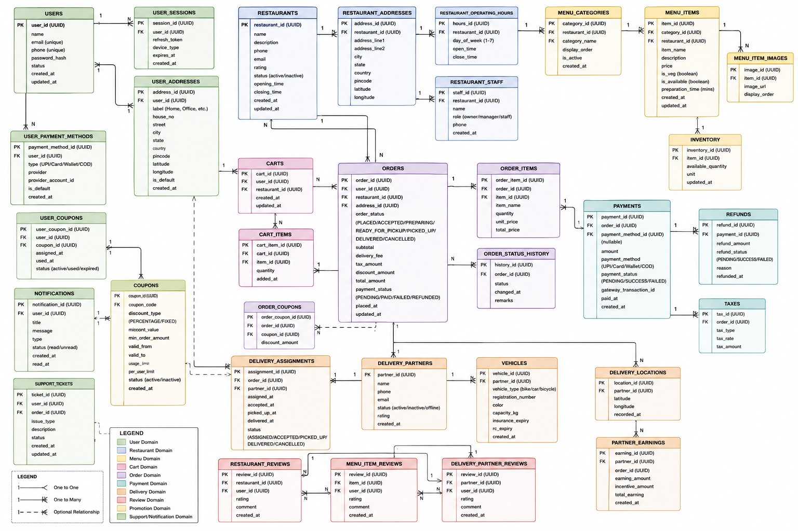

# Design a Food Delivery App Like Zomato

## 1. Functional Requirements

A food delivery platform primarily connects customers, restaurants, and delivery partners through a real-time order management system.

The core functionality starts with user onboarding. Customers should be able to register, log in, manage profiles, save addresses, and configure payment methods.

The platform must allow customers to discover restaurants based on location. Users should be able to search restaurants, browse menus, view item details, check ratings and reviews, and apply filters such as cuisine, price range, delivery time, and offers.

Customers should be able to add food items to a cart and place orders. During checkout, the system should calculate taxes, delivery charges, platform fees, discounts, and final payable amount.

Once an order is placed, the system should notify the restaurant. The restaurant can either accept or reject the order. After acceptance, food preparation begins.

The platform should assign a delivery partner to the order. The customer must be able to track the order status in real time, such as:

```text
PLACED
→ ACCEPTED
→ PREPARING
→ READY_FOR_PICKUP
→ PICKED_UP
→ DELIVERED
```

The system should support online payments through UPI, credit cards, wallets, and net banking. Cash-on-delivery can be optionally supported.

Customers should receive notifications regarding order status updates, payment status, promotions, and delivery updates.

The platform should allow users to rate restaurants, food items, and delivery partners after order completion.

Restaurants should be able to manage menus, prices, availability, operating hours, and incoming orders.

Delivery partners should receive delivery requests, accept assignments, update delivery status, and share location updates periodically.

---

## 2. Non-Functional Requirements

The system should support millions of users and thousands of concurrent orders during peak hours such as weekends and festivals.

Availability is extremely important because users place orders throughout the day. A target of 99.99% uptime is expected.

The platform should provide low latency restaurant search. Restaurant listings should ideally load within a few hundred milliseconds.

Real-time order tracking should have minimal delay. Delivery partner location updates should be reflected to customers within a few seconds.

The system should be horizontally scalable because order volume can increase significantly during lunch and dinner peaks.

Data consistency requirements differ across components.

For payments and orders, strong consistency is required because duplicate charges or incorrect order states are unacceptable.

For restaurant search, reviews, recommendations, and analytics, eventual consistency is acceptable because slight delays do not affect correctness.

The architecture should be fault tolerant. If one service fails, the entire platform should not become unavailable.

Security requirements include:

* Authentication and authorization
* Secure payment processing
* Encryption of sensitive data
* Protection against fraudulent orders
* Rate limiting APIs

---

## 3. High-Level System Design

At a high level, the platform follows a microservices architecture.

```text
                ┌──────────────┐
                │ Mobile Apps  │
                │ Web Clients  │
                └──────┬───────┘
                       │
                 API Gateway
                       │
    ┌──────────────────┼──────────────────┐
    │                  │                  │
 User Service   Restaurant Service   Order Service
    │                  │                  │
    └──────────────────┼──────────────────┘
                       │
                Payment Service
                       │
                Delivery Service
                       │
              Notification Service
                       │
                 Kafka / Events
                       │
       Analytics / Recommendation
```

The API Gateway acts as the entry point for all clients. It performs authentication, rate limiting, routing, and request aggregation.

The User Service manages customers, restaurants, and delivery partner accounts.

The Restaurant Service stores restaurant metadata, menus, pricing, ratings, and availability information.

The Order Service becomes the central orchestrator for order lifecycle management.

The Payment Service integrates with external payment gateways and handles transaction reconciliation.

The Delivery Service manages delivery partner availability, assignment, routing, and tracking.

The Notification Service sends push notifications, SMS messages, emails, and WhatsApp alerts.

Kafka is commonly used as the event backbone. Instead of services directly calling every dependent service synchronously, they publish events.

Example:

```text
Order Created
      │
      ▼
Kafka Topic
      │
 ┌────┼─────┬────────┐
 ▼    ▼     ▼        ▼
Payment Restaurant Delivery Analytics
```

This event-driven approach reduces coupling and improves scalability.

For example, when an order is created, analytics systems, recommendation systems, notifications, and loyalty systems can consume the event independently without impacting order placement latency.

---

## 4. Database Schema Design

A relational database such as PostgreSQL is commonly used for transactional data.

Users

```json
{
  "user_id": "UUID",
  "name": "John",
  "phone": "9999999999",
  "email": "john@example.com",
  "created_at": "timestamp"
}
```

Addresses

```json
{
  "address_id": "UUID",
  "user_id": "UUID",
  "latitude": 17.3850,
  "longitude": 78.4867,
  "address_line": "Madhapur Hyderabad"
}
```

Restaurants

```json
{
  "restaurant_id": "UUID",
  "name": "Pizza Hub",
  "rating": 4.5,
  "latitude": 17.38,
  "longitude": 78.48,
  "is_open": true
}
```

Menu Items

```json
{
  "item_id": "UUID",
  "restaurant_id": "UUID",
  "name": "Veg Pizza",
  "price": 250,
  "is_available": true
}
```

Orders

```json
{
  "order_id": "UUID",
  "user_id": "UUID",
  "restaurant_id": "UUID",
  "delivery_partner_id": "UUID",
  "status": "PREPARING",
  "total_amount": 450
}
```

Order Items

```json
{
  "order_item_id": "UUID",
  "order_id": "UUID",
  "item_id": "UUID",
  "quantity": 2,
  "price": 250
}
```

Delivery Partners

```json
{
  "partner_id": "UUID",
  "name": "Raj",
  "vehicle_type": "Bike",
  "is_online": true
}
```

Payments

```json
{
  "payment_id": "UUID",
  "order_id": "UUID",
  "amount": 450,
  "status": "SUCCESS"
}
```

Reviews

```json
{
  "review_id": "UUID",
  "user_id": "UUID",
  "restaurant_id": "UUID",
  "rating": 5,
  "comment": "Great food"
}
```

Relationship overview:

```text
User
 ├── Addresses
 ├── Orders
 └── Reviews

Restaurant
 ├── Menu Items
 ├── Orders
 └── Reviews

Order
 ├── Order Items
 ├── Payment
 └── Delivery Partner
```

---

## 5. API Design

These are the most frequently used APIs in the system.

Search Restaurants

```http
GET /restaurants?lat=17.38&lng=78.48
```

Response:

```json
[
  {
    "restaurantId": "r1",
    "name": "Pizza Hub",
    "rating": 4.5,
    "deliveryTime": 25
  }
]
```

---

Get Restaurant Menu

```http
GET /restaurants/{restaurantId}/menu
```

---

Create Order

```http
POST /orders
```

Request:

```json
{
  "restaurantId": "r1",
  "items": [
    {
      "itemId": "i1",
      "quantity": 2
    }
  ],
  "addressId": "a1"
}
```

Response:

```json
{
  "orderId": "o123",
  "status": "PLACED"
}
```

---

Track Order

```http
GET /orders/{orderId}
```

Response:

```json
{
  "orderId": "o123",
  "status": "PICKED_UP",
  "deliveryPartnerLocation": {
    "lat": 17.39,
    "lng": 78.49
  }
}
```

---

Update Delivery Location

```http
POST /delivery/location
```

Request:

```json
{
  "partnerId": "p1",
  "lat": 17.39,
  "lng": 78.49
}
```

---

## 6. Deep Dive into Key Components

## Order Management Service

The Order Service is the heart of the platform.

When a customer places an order, inventory validation, menu validation, pricing validation, discount validation, payment processing, and restaurant notification must occur.

A common production approach is to use a state machine.

```text
PLACED
   │
   ▼
PAYMENT_SUCCESS
   │
   ▼
RESTAURANT_ACCEPTED
   │
   ▼
PREPARING
   │
   ▼
READY_FOR_PICKUP
   │
   ▼
PICKED_UP
   │
   ▼
DELIVERED
```

Using a state machine prevents invalid transitions.

For example:

```text
DELIVERED
   │
   ▼
PREPARING
```

should never be allowed.

The Order Service typically owns order state transitions and publishes events whenever state changes occur.

---

## Delivery Assignment Service

Finding the right delivery partner is a critical problem.

A naive solution scans all delivery partners.

```text
Time Complexity = O(N)
```

This becomes expensive when hundreds of thousands of delivery partners are online.

Production systems use geospatial indexing.

Common implementations include:

* Redis GEO Index
* PostGIS
* Geohash-based partitioning

Example:

```text
Restaurant Location
        │
        ▼
Find nearest 20 riders
        │
        ▼
Rank by:
   Distance
   Availability
   Current workload
   ETA
        │
        ▼
Assign best rider
```

This reduces assignment latency significantly.

---

## Real-Time Tracking System

Delivery partners send location updates every few seconds.

Sending every update directly to databases would create massive write loads.

A scalable approach is:

```text
Driver App
      │
      ▼
Location Service
      │
      ▼
Redis
      │
      ▼
WebSocket Gateway
      │
      ▼
Customer App
```

Redis acts as an in-memory location store.

WebSockets provide real-time push updates.

The database stores only periodic snapshots for historical analytics.

This architecture avoids overwhelming databases with high-frequency writes.

---

## 7. Address Key Concerns

**How do we handle restaurant search at scale?**

Restaurant data is indexed in search engines such as Elasticsearch. Search queries are served from Elasticsearch instead of relational databases because it supports geo-search, filtering, sorting, and full-text search efficiently.

---

**How do we prevent duplicate orders?**

Idempotency keys are used.

```http
Idempotency-Key: abc123
```

If the client retries due to network failure, the server returns the same order instead of creating a duplicate.

---

**How do we handle payment failures?**

Order creation and payment processing are separated.

The order remains in a pending state until payment confirmation arrives from the payment gateway webhook.

This prevents inconsistent order states.

---

**How do we scale notifications?**

Notifications are handled asynchronously.

```text
Order Delivered Event
        │
        ▼
Kafka
        │
        ▼
Notification Service
        │
        ▼
Push / SMS / Email
```

The Order Service does not wait for notification delivery, which keeps order operations fast.

---

**What happens if a delivery partner cancels after assignment?**

The Delivery Service publishes a reassignment event.

```text
Rider Cancelled
      │
      ▼
Reassignment Queue
      │
      ▼
Find Next Rider
```

The order continues without affecting restaurant preparation.

---

**Potential Bottlenecks**

The Order Service is often the most critical bottleneck because every order flows through it.

To scale it:

* Partition orders using Order ID or Region.
* Use read replicas for heavy read traffic.
* Cache frequently accessed order data.
* Use Kafka for asynchronous workflows.
* Keep synchronous operations minimal during checkout.

In large-scale systems, the most common architecture is:

```text
Client
   │
API Gateway
   │
Order Service
   │
Kafka Event Bus
   │
Microservices
   ├── Payment
   ├── Delivery
   ├── Notifications
   ├── Analytics
   └── Recommendation
```

This event-driven architecture enables independent scaling, loose coupling, high availability, and the ability to process millions of food orders per day in production systems similar to Zomato, Swiggy, Uber Eats, and DoorDash.

---

# Database Schema Design for a Food Delivery App Like Zomato

When designing the database for a food delivery platform, the goal is not just to store orders and restaurants. The schema must support customer onboarding, restaurant management, menu management, cart operations, ordering, payments, delivery tracking, promotions, reviews, notifications, customer support, and analytics.

A common interview mistake is designing only 5–6 tables such as Users, Restaurants, Orders, and Payments. Real production systems usually contain dozens of entities because each business domain evolves independently.

A good approach is to split the schema into bounded domains:

1. User Domain
2. Restaurant Domain
3. Menu Domain
4. Cart Domain
5. Order Domain
6. Payment Domain
7. Delivery Domain
8. Review Domain
9. Promotion Domain
10. Notification Domain
11. Support Domain
12. Analytics Domain

---



## High-Level Entity Relationship Diagram

```text
User
 ├── Addresses
 ├── Cart
 ├── Orders
 ├── Payments
 ├── Reviews
 ├── Coupons
 └── Notifications

Restaurant
 ├── Restaurant_Address
 ├── Menu_Categories
 ├── Menu_Items
 ├── Inventory
 ├── Orders
 ├── Reviews
 └── Restaurant_Staff

Order
 ├── Order_Items
 ├── Payment
 ├── Delivery
 ├── Coupons
 ├── Taxes
 └── Refunds

Delivery_Partner
 ├── Vehicle
 ├── Delivery_Assignment
 ├── Location_Tracking
 └── Earnings
```

---

## User Domain

The user domain stores customer information.

## Users

```sql
CREATE TABLE users (
    user_id UUID PRIMARY KEY,
    name VARCHAR(200),
    email VARCHAR(255) UNIQUE,
    phone VARCHAR(20) UNIQUE,
    password_hash TEXT,
    status VARCHAR(20),
    created_at TIMESTAMP,
    updated_at TIMESTAMP
);
```

A user can place many orders and save multiple delivery addresses.

---

## User Addresses

```sql
CREATE TABLE user_addresses (
    address_id UUID PRIMARY KEY,
    user_id UUID REFERENCES users(user_id),

    house_no VARCHAR(100),
    street VARCHAR(255),
    city VARCHAR(100),
    state VARCHAR(100),
    country VARCHAR(100),

    latitude DECIMAL(10,7),
    longitude DECIMAL(10,7),

    is_default BOOLEAN,

    created_at TIMESTAMP
);
```

One user can have:

```text
Home Address
Office Address
Friend's Address
```

Therefore a one-to-many relationship exists.

---

## User Sessions

```sql
CREATE TABLE user_sessions (
    session_id UUID PRIMARY KEY,
    user_id UUID REFERENCES users(user_id),
    refresh_token TEXT,
    device_type VARCHAR(50),
    expires_at TIMESTAMP
);
```

Used for login management.

---

## Restaurant Domain

Restaurants are one of the core business entities.

## Restaurants

```sql
CREATE TABLE restaurants (
    restaurant_id UUID PRIMARY KEY,

    name VARCHAR(255),

    description TEXT,

    phone VARCHAR(20),

    email VARCHAR(255),

    rating DECIMAL(3,2),

    status VARCHAR(50),

    opening_time TIME,

    closing_time TIME,

    created_at TIMESTAMP
);
```

---

## Restaurant Addresses

```sql
CREATE TABLE restaurant_addresses (
    address_id UUID PRIMARY KEY,

    restaurant_id UUID REFERENCES restaurants(restaurant_id),

    latitude DECIMAL(10,7),

    longitude DECIMAL(10,7),

    address_line TEXT
);
```

Location is separated because geo-search queries are common.

---

## Restaurant Staff

```sql
CREATE TABLE restaurant_staff (
    staff_id UUID PRIMARY KEY,

    restaurant_id UUID REFERENCES restaurants(restaurant_id),

    name VARCHAR(200),

    role VARCHAR(50)
);
```

Examples:

```text
Manager
Cashier
Kitchen Staff
Owner
```

---

## Restaurant Operating Hours

```sql
CREATE TABLE restaurant_operating_hours (
    id UUID PRIMARY KEY,

    restaurant_id UUID REFERENCES restaurants(restaurant_id),

    day_of_week INT,

    open_time TIME,

    close_time TIME
);
```

Useful when restaurants have different schedules for weekdays and weekends.

---

## Menu Domain

Menus change frequently and should be isolated.

## Menu Categories

```sql
CREATE TABLE menu_categories (
    category_id UUID PRIMARY KEY,

    restaurant_id UUID REFERENCES restaurants(restaurant_id),

    category_name VARCHAR(200)
);
```

Examples:

```text
Pizza
Burgers
Desserts
Beverages
```

---

## Menu Items

```sql
CREATE TABLE menu_items (
    item_id UUID PRIMARY KEY,

    category_id UUID REFERENCES menu_categories(category_id),

    restaurant_id UUID REFERENCES restaurants(restaurant_id),

    item_name VARCHAR(255),

    description TEXT,

    price DECIMAL(10,2),

    is_veg BOOLEAN,

    is_available BOOLEAN
);
```

---

## Menu Item Images

```sql
CREATE TABLE menu_item_images (
    image_id UUID PRIMARY KEY,

    item_id UUID REFERENCES menu_items(item_id),

    image_url TEXT
);
```

Images are generally stored in object storage.

Example:

```text
S3
GCS
Azure Blob Storage
```

Only URLs are stored in the database.

---

## Inventory

```sql
CREATE TABLE inventory (
    inventory_id UUID PRIMARY KEY,

    item_id UUID REFERENCES menu_items(item_id),

    available_quantity INT,

    updated_at TIMESTAMP
);
```

Useful for limited stock items.

---

## Cart Domain

Cart data is usually stored in Redis for performance but persisted in SQL.

## Cart

```sql
CREATE TABLE carts (
    cart_id UUID PRIMARY KEY,

    user_id UUID REFERENCES users(user_id),

    restaurant_id UUID REFERENCES restaurants(restaurant_id),

    created_at TIMESTAMP
);
```

---

## Cart Items

```sql
CREATE TABLE cart_items (
    cart_item_id UUID PRIMARY KEY,

    cart_id UUID REFERENCES carts(cart_id),

    item_id UUID REFERENCES menu_items(item_id),

    quantity INT
);
```

---

## Order Domain

This is the most important domain.

## Orders

```sql
CREATE TABLE orders (
    order_id UUID PRIMARY KEY,

    user_id UUID REFERENCES users(user_id),

    restaurant_id UUID REFERENCES restaurants(restaurant_id),

    address_id UUID REFERENCES user_addresses(address_id),

    order_status VARCHAR(50),

    subtotal DECIMAL(10,2),

    delivery_fee DECIMAL(10,2),

    tax_amount DECIMAL(10,2),

    discount_amount DECIMAL(10,2),

    total_amount DECIMAL(10,2),

    created_at TIMESTAMP
);
```

Order status:

```text
PLACED
ACCEPTED
PREPARING
READY_FOR_PICKUP
PICKED_UP
DELIVERED
CANCELLED
```

---

## Order Items

```sql
CREATE TABLE order_items (
    order_item_id UUID PRIMARY KEY,

    order_id UUID REFERENCES orders(order_id),

    item_id UUID REFERENCES menu_items(item_id),

    item_name VARCHAR(255),

    quantity INT,

    unit_price DECIMAL(10,2)
);
```

Important design decision:

Store snapshot values.

Do not rely on current menu item prices because prices may change after the order is placed.

---

## Order Status History

```sql
CREATE TABLE order_status_history (
    history_id UUID PRIMARY KEY,

    order_id UUID REFERENCES orders(order_id),

    status VARCHAR(50),

    changed_at TIMESTAMP
);
```

Useful for customer support and auditing.

---

## Payment Domain

## Payments

```sql
CREATE TABLE payments (
    payment_id UUID PRIMARY KEY,

    order_id UUID REFERENCES orders(order_id),

    amount DECIMAL(10,2),

    payment_method VARCHAR(50),

    payment_status VARCHAR(50),

    gateway_transaction_id VARCHAR(255),

    created_at TIMESTAMP
);
```

---

## Refunds

```sql
CREATE TABLE refunds (
    refund_id UUID PRIMARY KEY,

    payment_id UUID REFERENCES payments(payment_id),

    refund_amount DECIMAL(10,2),

    refund_status VARCHAR(50)
);
```

---

## Delivery Domain

## Delivery Partners

```sql
CREATE TABLE delivery_partners (
    partner_id UUID PRIMARY KEY,

    name VARCHAR(255),

    phone VARCHAR(20),

    status VARCHAR(50),

    rating DECIMAL(3,2)
);
```

---

## Vehicles

```sql
CREATE TABLE vehicles (
    vehicle_id UUID PRIMARY KEY,

    partner_id UUID REFERENCES delivery_partners(partner_id),

    vehicle_type VARCHAR(50),

    registration_number VARCHAR(100)
);
```

---

## Delivery Assignments

```sql
CREATE TABLE delivery_assignments (
    assignment_id UUID PRIMARY KEY,

    order_id UUID REFERENCES orders(order_id),

    partner_id UUID REFERENCES delivery_partners(partner_id),

    assigned_at TIMESTAMP
);
```

---

## Live Location Tracking

```sql
CREATE TABLE delivery_locations (
    location_id UUID PRIMARY KEY,

    partner_id UUID REFERENCES delivery_partners(partner_id),

    latitude DECIMAL(10,7),

    longitude DECIMAL(10,7),

    recorded_at TIMESTAMP
);
```

Production systems often store recent locations in Redis and archive historical locations in databases.

---

## Review Domain

## Restaurant Reviews

```sql
CREATE TABLE restaurant_reviews (
    review_id UUID PRIMARY KEY,

    restaurant_id UUID REFERENCES restaurants(restaurant_id),

    user_id UUID REFERENCES users(user_id),

    rating INT,

    comment TEXT
);
```

---

## Item Reviews

```sql
CREATE TABLE menu_item_reviews (
    review_id UUID PRIMARY KEY,

    item_id UUID REFERENCES menu_items(item_id),

    user_id UUID REFERENCES users(user_id),

    rating INT,

    comment TEXT
);
```

---

## Delivery Partner Reviews

```sql
CREATE TABLE delivery_reviews (
    review_id UUID PRIMARY KEY,

    partner_id UUID REFERENCES delivery_partners(partner_id),

    user_id UUID REFERENCES users(user_id),

    rating INT,

    comment TEXT
);
```

---

## Promotion Domain

## Coupons

```sql
CREATE TABLE coupons (
    coupon_id UUID PRIMARY KEY,

    coupon_code VARCHAR(50),

    discount_type VARCHAR(20),

    discount_value DECIMAL(10,2),

    expiry_date TIMESTAMP
);
```

---

## User Coupons

```sql
CREATE TABLE user_coupons (
    user_coupon_id UUID PRIMARY KEY,

    user_id UUID REFERENCES users(user_id),

    coupon_id UUID REFERENCES coupons(coupon_id)
);
```

---

## Notification Domain

## Notifications

```sql
CREATE TABLE notifications (
    notification_id UUID PRIMARY KEY,

    user_id UUID REFERENCES users(user_id),

    title VARCHAR(255),

    message TEXT,

    status VARCHAR(20),

    created_at TIMESTAMP
);
```

---

## Support Domain

## Support Tickets

```sql
CREATE TABLE support_tickets (
    ticket_id UUID PRIMARY KEY,

    user_id UUID REFERENCES users(user_id),

    order_id UUID REFERENCES orders(order_id),

    issue_type VARCHAR(100),

    status VARCHAR(50),

    created_at TIMESTAMP
);
```

Examples:

```text
Food Missing
Wrong Order
Refund Request
Late Delivery
```

---

## Analytics Domain

For reporting, analytics data is generally not queried from OLTP databases directly.

Instead, events are streamed through Kafka.

```text
Order Created
Order Delivered
Payment Success
Restaurant Viewed
Menu Clicked
```

These events flow into:

```text
Kafka
   ↓
Data Lake
   ↓
Data Warehouse
   ↓
Analytics Dashboard
```

Common choices:

```text
Kafka
Spark
BigQuery
Snowflake
Redshift
ClickHouse
```

---

## Final Entity Relationship Summary

```text
Users
 ├── UserAddresses
 ├── UserSessions
 ├── Carts
 ├── Orders
 ├── Payments
 ├── Reviews
 ├── Notifications
 └── SupportTickets

Restaurants
 ├── RestaurantAddresses
 ├── OperatingHours
 ├── Staff
 ├── MenuCategories
 ├── MenuItems
 │     ├── Images
 │     ├── Inventory
 │     └── Reviews
 ├── Orders
 └── Reviews

Orders
 ├── OrderItems
 ├── StatusHistory
 ├── Payments
 ├── Refunds
 ├── DeliveryAssignments
 └── SupportTickets

DeliveryPartners
 ├── Vehicles
 ├── DeliveryAssignments
 ├── Locations
 ├── Reviews
 └── Earnings

Promotions
 ├── Coupons
 └── UserCoupons

Communication
 └── Notifications
```

This schema covers roughly **90–95% of the entities found in a production-grade food delivery platform such as Zomato, Swiggy, DoorDash, or Uber Eats**, while keeping transactional concerns, delivery operations, payments, customer support, and restaurant management properly separated into scalable domains.

---
