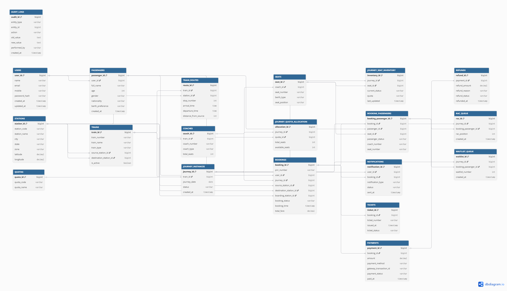

# Design a Railway Booking App like IRCTC

## 1. Functional Requirements

**Core User Features**

* Users should be able to register and log in using mobile number, email, or social authentication.
* Users should be able to search trains between source and destination stations for a given date.
* Users should be able to view train schedules, routes, halt stations, travel duration, and fare information.
* Users should be able to check seat availability across different travel classes such as Sleeper, 3A, 2A, 1A, and Chair Car.
* Users should be able to book tickets for one or multiple passengers in a single transaction.
* Users should be able to make payments using multiple payment methods such as UPI, net banking, credit cards, debit cards, and wallets.
* Users should receive booking confirmation immediately after successful payment.
* Users should be able to view booked tickets and travel history.
* Users should be able to cancel tickets and receive refunds according to railway policies.
* Users should be able to download or view e-tickets.

**Reservation and Seat Management**

* The system should allocate seats automatically based on seat availability.
* The system should support RAC (Reservation Against Cancellation).
* The system should support Waitlist ticket booking.
* The system should automatically promote passengers from Waitlist → RAC → Confirmed when cancellations occur.
* The system should maintain berth preferences wherever possible.
* The system should prevent double booking of the same seat.

**Notification Features**

* Send booking confirmations via SMS, Email, and Push Notifications.
* Send cancellation and refund notifications.
* Send waitlist status updates and confirmation alerts.

**Administrative Features**

* Railway administrators should manage train schedules.
* Railway administrators should manage train routes and station information.
* Railway administrators should configure fare rules and reservation quotas.
* Railway administrators should monitor bookings and operational statistics.

**Additional Features**

* Tatkal booking support.
* Premium Tatkal booking support.
* Dynamic pricing for selected trains.
* Special quota management such as Senior Citizen, Ladies, Defence, and VIP quotas.
* Multi-language support.
* Passenger profile management.

---

## 2. Non-Functional Requirements

* The system should support millions of daily active users.
* The system should handle extremely high traffic spikes during Tatkal booking windows.
* The booking system should provide strong consistency for seat allocation.
* The system should ensure no seat is sold to multiple passengers.
* The system should provide high availability with minimal downtime.
* The system should be fault tolerant and recover automatically from failures.
* The system should provide low latency search responses.
* The system should support horizontal scaling of stateless services.
* The system should guarantee transactional integrity during booking and payment processing.
* The system should provide secure payment processing and data encryption.
* The system should support disaster recovery across multiple regions.
* The system should maintain comprehensive audit logs.
* The system should support real-time seat availability updates.
* The system should provide 99.99% availability for critical booking operations.
* The system should support eventual consistency where strict consistency is not required.
* The system should comply with security and privacy regulations.

---

## 3. High-Level System Design

At a high level, the system can be divided into multiple independent services communicating through APIs and asynchronous events.

```text
                +----------------+
                |  Mobile/Web UI |
                +--------+-------+
                         |
                         v
                +----------------+
                | API Gateway    |
                +--------+-------+
                         |
      -----------------------------------------
      |        |          |         |         |
      v        v          v         v         v

+---------+ +---------+ +---------+ +---------+ +---------+
| User    | | Search  | | Booking | | Payment | | Train   |
| Service | | Service | | Service | | Service | | Service |
+---------+ +---------+ +---------+ +---------+ +---------+
      |           |           |          |          |
      ------------------------------------------------
                         |
                         v

               +-------------------+
               | Event Bus / Kafka |
               +---------+---------+
                         |
      -----------------------------------------
      |            |            |             |
      v            v            v             v

+-----------+ +-----------+ +-----------+ +-----------+
| Notification| | Analytics | | Refund   | | Waitlist |
| Service     | | Service   | | Service  | | Engine   |
+-----------+ +-----------+ +-----------+ +-----------+

                         |
                         v

              +---------------------+
              | Databases & Cache   |
              +---------------------+
```

**Client Applications**

Users interact through web browsers and mobile applications. These clients communicate only with the API Gateway, which acts as the single entry point for the system.

**API Gateway**

The API Gateway handles authentication, authorization, request routing, rate limiting, traffic throttling, and request logging.

During Tatkal booking periods, the API Gateway becomes extremely important because it can limit excessive requests and prevent backend overload.

**User Service**

This service manages user registration, login, passenger profiles, saved travelers, and authentication tokens.

Since user-related operations are independent of bookings, separating them improves scalability and maintainability.

**Train Service**

This service manages train schedules, routes, station information, coach composition, travel classes, quotas, and fare information.

Train schedules change infrequently compared to bookings, making them suitable for caching.

**Search Service**

Search is one of the most frequently used operations.

Users perform significantly more searches than actual bookings. Therefore, search functionality is isolated into its own service and heavily optimized using caching.

Instead of querying reservation databases directly, search requests are often served from precomputed availability data stored in cache layers.

This reduces load on booking systems.

**Booking Service**

This is the most critical component of the system.

The Booking Service is responsible for:

* Seat reservation
* RAC allocation
* Waitlist allocation
* Ticket creation
* Booking state management

The booking service must guarantee strong consistency.

A seat can only belong to one passenger at a time.

This service usually owns the reservation inventory and becomes the source of truth for seat allocation.

**Payment Service**

The Payment Service integrates with external payment gateways.

Its responsibilities include:

* Payment initiation
* Payment verification
* Payment reconciliation
* Refund processing

Booking confirmation should occur only after successful payment verification.

To avoid seat loss during payment processing, temporary seat holds are typically created before payment completion.

**Notification Service**

This service sends:

* SMS alerts
* Email confirmations
* Push notifications

Notifications are handled asynchronously because they are not part of the critical booking transaction.

Even if notifications are delayed, bookings remain successful.

**Waitlist Management Engine**

Waitlist movement is a separate business workflow.

Whenever a confirmed ticket is cancelled:

1. The vacant seat becomes available.
2. RAC passengers are upgraded first.
3. Waitlisted passengers are promoted to RAC.
4. Notifications are sent to affected passengers.

This process is often event-driven and automated.

**Analytics Service**

The analytics platform collects:

* Booking trends
* Cancellation rates
* Revenue metrics
* Train occupancy data
* Demand forecasting data

Analytical workloads should be separated from transactional systems to avoid impacting booking performance.

---

**Asynchronous Event-Driven Architecture**

A modern IRCTC-like system heavily relies on event-driven architecture.

Instead of tightly coupling services, events are published to a message broker such as Kafka.

Example booking flow:

```text
Booking Confirmed
        |
        v
  Booking Event Published
        |
        +--------------------+
        |                    |
        v                    v
Notification Service   Analytics Service
        |
        v
 SMS / Email Sent
```

Example cancellation flow:

```text
Ticket Cancelled
        |
        v
Cancellation Event
        |
        +------------------+
        |                  |
        v                  v
Refund Service     Waitlist Engine
        |
        v
Refund Initiated
```

This architecture provides several advantages:

* Better scalability.
* Loose coupling between services.
* Independent deployments.
* Improved fault isolation.
* Easier integration of new features.

For example, adding a recommendation system later only requires consuming booking events without modifying the booking service itself.

---

**Major Bottleneck in IRCTC**

The biggest bottleneck is not train search but seat allocation during booking.

During Tatkal opening, millions of users may try to reserve the same limited set of seats simultaneously.

The primary architectural challenge is ensuring:

```text
One Seat
    =
One Passenger
```

under extreme concurrency.

Therefore, the Booking Service is usually designed with strict transactional guarantees and strong consistency, while surrounding services such as notifications and analytics operate asynchronously for scalability.

---

This high-level architecture follows the same fundamental principles used in large-scale reservation systems: separate read-heavy and write-heavy workloads, maintain strong consistency for inventory allocation, and leverage event-driven processing for all non-critical workflows.

---

# Database Schema Design for IRCTC-like Railway Reservation System

The most important design principle in an IRCTC-like system is to separate **static railway data**, **reservation inventory**, **booking transactions**, and **payment workflows**.

A common mistake in interviews is storing seat availability directly inside train tables. In reality, reservation inventory becomes massive because every train runs on multiple dates and every seat has a different status for each journey date.

The database should therefore be divided into:

```text
1. Master Data
2. Train & Route Data
3. Journey Inventory Data
4. Booking Data
5. Payment Data
6. Waitlist/RAC Data
7. Notification Data
8. Audit & Operational Data
```

---

## Core Entities

```text
User
Passenger
Station
Train
TrainRoute
Coach
Seat
JourneyInstance
JourneySeatInventory
Booking
BookingPassenger
Ticket
Payment
Refund
Waitlist
RAC
Notification
```

---

## User Management

Users may book tickets for themselves or family members.

```sql
USERS
------
user_id (PK)
name
email
mobile
password_hash
created_at
updated_at
```

---

```sql
PASSENGERS
-----------
passenger_id (PK)
user_id (FK -> USERS)
full_name
age
gender
nationality
berth_preference
created_at
```

Relationship:

```text
User (1) -----> (N) Passenger
```

One user can save multiple passengers.

Example:

```text
User:
Raj

Passengers:
Raj
Wife
Son
Mother
```

---

## Railway Station Management

```sql
STATIONS
----------
station_id (PK)
station_code
station_name
city
state
zone
latitude
longitude
```

Example:

```text
VSKP
BBS
HYD
NDLS
```

---

## Train Management

Train information changes very rarely.

```sql
TRAINS
--------
train_id (PK)
train_number
train_name
train_type
source_station_id
destination_station_id
is_active
```

Relationship:

```text
Station ----> Train Source
Station ----> Train Destination
```

---

## Route Management

A train consists of multiple stops.

```sql
TRAIN_ROUTES
-------------
route_id (PK)
train_id (FK)

station_id (FK)

stop_number

arrival_time

departure_time

distance_from_source
```

Example:

```text
12841

1. Shalimar
2. Kharagpur
3. Bhubaneswar
4. Visakhapatnam
5. Vijayawada
6. Chennai
```

Relationship:

```text
Train (1)
   |
   +------> (N) Route Stations
```

---

## Coach Management

Every train contains multiple coaches.

```sql
COACHES
---------
coach_id (PK)

train_id (FK)

coach_number

coach_type

total_seats
```

Example:

```text
B1
B2
B3
S1
S2
A1
```

---

## Seat Management

Static seat definitions.

```sql
SEATS
-------
seat_id (PK)

coach_id (FK)

seat_number

berth_type

seat_position
```

Example:

```text
Seat 1 - Lower
Seat 2 - Middle
Seat 3 - Upper
```

Relationship:

```text
Coach (1)
      |
      +-----> (N) Seats
```

---

## Journey Instance

One train runs every day.

Reservation happens against a specific train date.

This is one of the most important entities.

```sql
JOURNEY_INSTANCES
------------------
journey_id (PK)

train_id (FK)

journey_date

status

created_at
```

Example:

```text
Train 12841

Journey:
10 Jan
11 Jan
12 Jan
13 Jan
```

Instead of creating bookings against train directly:

```text
Booking
    |
    +----> Journey Instance
```

---

## Reservation Inventory

This is the heart of the system.

Each seat has a status for each journey.

```sql
JOURNEY_SEAT_INVENTORY
-----------------------

inventory_id (PK)

journey_id (FK)

seat_id (FK)

current_status

quota

last_updated
```

Status:

```text
AVAILABLE
BOOKED
RAC
WAITLIST
BLOCKED
```

Relationship:

```text
Journey Instance (1)
        |
        +------> (N) Seat Inventory

Seat (1)
        |
        +------> (N) Seat Inventory
```

This table is the source of truth for seat allocation.

---

## Booking Management

Represents a reservation transaction.

```sql
BOOKINGS
----------
booking_id (PK)

pnr_number

user_id (FK)

journey_id (FK)

booking_status

booking_time

total_fare
```

Status:

```text
CONFIRMED
RAC
WAITLIST
CANCELLED
PARTIALLY_CANCELLED
```

Relationship:

```text
User (1)
   |
   +-----> (N) Bookings
```

---

## Booking Passenger Mapping

One booking can contain multiple passengers.

```sql
BOOKING_PASSENGERS
-------------------

booking_passenger_id (PK)

booking_id (FK)

passenger_id (FK)

seat_id (FK)

passenger_status

coach_number

seat_number
```

Status:

```text
CONFIRMED
RAC
WL
CANCELLED
```

Example:

```text
PNR 123

Raj
Seat B1-21

Priya
Seat B1-22

Rahul
Seat B1-23
```

Relationship:

```text
Booking (1)
      |
      +------> (N) Booking Passengers
```

---

## Ticket Entity

Many companies separate ticket from booking.

```sql
TICKETS
---------
ticket_id (PK)

booking_id (FK)

ticket_number

issued_at

ticket_status
```

Relationship:

```text
Booking (1)
      |
      +------> Ticket
```

---

## Payment Management

```sql
PAYMENTS
----------
payment_id (PK)

booking_id (FK)

amount

payment_method

gateway_transaction_id

payment_status

paid_at
```

Status:

```text
PENDING
SUCCESS
FAILED
REFUNDED
```

Relationship:

```text
Booking (1)
      |
      +------> Payment
```

---

## Refund Management

```sql
REFUNDS
---------
refund_id (PK)

payment_id (FK)

refund_amount

refund_reason

refund_status

refunded_at
```

Relationship:

```text
Payment (1)
      |
      +------> Refund
```

---

## RAC Management

RAC is typically maintained separately.

```sql
RAC_QUEUE
-----------
rac_id (PK)

journey_id (FK)

booking_passenger_id (FK)

rac_position

created_at
```

Example:

```text
RAC-1
RAC-2
RAC-3
```

---

## Waitlist Management

```sql
WAITLIST_QUEUE
----------------

waitlist_id (PK)

journey_id (FK)

booking_passenger_id (FK)

waitlist_number

created_at
```

Example:

```text
WL-1
WL-2
WL-3
```

Relationship:

```text
Journey (1)
      |
      +------> RAC Queue

Journey (1)
      |
      +------> Waitlist Queue
```

---

## Notification Management

```sql
NOTIFICATIONS
---------------
notification_id (PK)

user_id (FK)

booking_id (FK)

notification_type

status

sent_at
```

Type:

```text
SMS
EMAIL
PUSH
```

---

## Quota Management

IRCTC supports multiple quotas.

```sql
QUOTAS
--------
quota_id (PK)

quota_code

quota_name
```

Examples:

```text
GENERAL
LADIES
DEFENCE
TATKAL
PREMIUM_TATKAL
SENIOR_CITIZEN
```

---

```sql
JOURNEY_QUOTA_ALLOCATION
-------------------------

allocation_id (PK)

journey_id (FK)

quota_id (FK)

total_seats

available_seats
```

---

## Audit Logs

Important for compliance and debugging.

```sql
AUDIT_LOGS
------------
audit_id (PK)

entity_type

entity_id

action

old_value

new_value

performed_by

created_at
```

Examples:

```text
Booking Created
Ticket Cancelled
Seat Allocated
Refund Processed
```

---

## ERD Diagram



## Complete Relationship Diagram

```text
USERS
  |
  +----------------------+
  |                      |
  v                      v
PASSENGERS           BOOKINGS
                          |
                          |
                          v
                  BOOKING_PASSENGERS
                          |
                          |
                          v
                        SEATS
                          |
                          v
                       COACHES
                          |
                          v
                        TRAINS
                          |
                          v
                    TRAIN_ROUTES
                          |
                          v
                      STATIONS

TRAINS
   |
   v
JOURNEY_INSTANCES
   |
   +---------------------------+
   |                           |
   v                           v
JOURNEY_SEAT_INVENTORY    JOURNEY_QUOTA_ALLOCATION
   |                           |
   |                           |
   v                           v
 SEATS                      QUOTAS

BOOKINGS
   |
   +----------+
   |          |
   v          v
PAYMENTS   TICKETS
   |
   v
REFUNDS

BOOKING_PASSENGERS
   |
   +----------------+
   |                |
   v                v
RAC_QUEUE     WAITLIST_QUEUE

BOOKINGS
   |
   v
NOTIFICATIONS
```

## Storage Selection for Major Entities

| Entity                 | Storage                  | Reason                           |
| ---------------------- | ------------------------ | -------------------------------- |
| Users                  | PostgreSQL               | Strong consistency               |
| Passengers             | PostgreSQL               | Relational data                  |
| Stations               | PostgreSQL               | Master data                      |
| Trains                 | PostgreSQL               | Master data                      |
| Train Routes           | PostgreSQL               | Relational queries               |
| Coaches                | PostgreSQL               | Structured data                  |
| Seats                  | PostgreSQL               | Strong consistency               |
| Journey Instances      | PostgreSQL               | Reservation metadata             |
| Journey Seat Inventory | PostgreSQL (Partitioned) | Critical transactional inventory |
| Bookings               | PostgreSQL               | ACID transactions                |
| Booking Passengers     | PostgreSQL               | Reservation consistency          |
| Payments               | PostgreSQL               | Financial transactions           |
| Refunds                | PostgreSQL               | Financial records                |
| RAC Queue              | PostgreSQL / Redis       | Fast queue operations            |
| Waitlist Queue         | PostgreSQL / Redis       | Fast queue operations            |
| Notifications          | PostgreSQL               | Tracking delivery status         |
| Audit Logs             | PostgreSQL + Data Lake   | Compliance and analytics         |
| Search Cache           | Redis                    | Low latency availability search  |
| Analytics Data         | Data Warehouse           | Reporting and BI                 |

For interview discussions, the most critical tables are **JOURNEY_INSTANCES**, **JOURNEY_SEAT_INVENTORY**, **BOOKINGS**, and **BOOKING_PASSENGERS** because they collectively solve the hardest problem in IRCTC: maintaining seat inventory consistency while supporting RAC and Waitlist promotion under extremely high concurrency.

---
