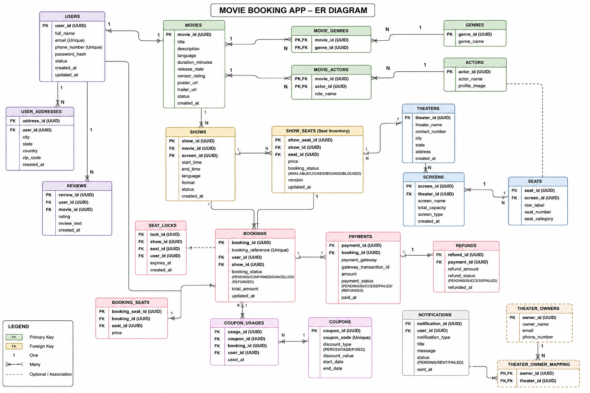

# Design a Movie Booking App Like BookMyShow

## 1. Functional Requirements

**User Management**

* Users should be able to register and login using email, phone number, or social authentication.
* Users should be able to manage their profile information.
* Users should be able to view booking history and previously purchased tickets.

**Movie Discovery**

* Users should be able to browse currently running movies.
* Users should be able to view upcoming movies.
* Users should be able to search movies by name, language, genre, actor, or city.
* Users should be able to see movie details such as synopsis, cast, duration, ratings, trailers, and reviews.

**Theater and Show Discovery**

* Users should be able to view theaters available in a city.
* Users should be able to view available shows for a selected movie.
* Users should be able to filter shows based on language, format (2D, 3D, IMAX), timing, and theater.

**Seat Selection**

* Users should be able to view real-time seat availability.
* Users should be able to select one or more seats.
* Selected seats should be temporarily blocked during the booking process.
* Users should be able to view seat categories such as Premium, Gold, Silver, Recliner, etc.

**Booking Management**

* Users should be able to create a booking.
* Users should be able to confirm bookings after successful payment.
* Users should be able to cancel bookings if theater policies allow.
* Users should be able to receive booking confirmation.

**Payment Processing**

* Users should be able to pay using UPI, cards, net banking, wallets, and other payment methods.
* The system should handle payment success and failure scenarios.
* The system should support refunds for canceled bookings.

**Notifications**

* Users should receive booking confirmations through SMS, email, or push notifications.
* Users should receive reminders before movie showtime.

**Admin and Theater Partner Management**

* Theater operators should be able to manage screens and seats.
* Theater operators should be able to configure show schedules.
* Admins should be able to manage movies, theaters, pricing, promotions, and reports.

**Offers and Promotions**

* Users should be able to apply coupons and promotional offers.
* The system should support campaign-based discounts.

---

## 2. Non-Functional Requirements

**High Availability**

* The platform should remain available even during blockbuster movie releases.
* Target availability should be at least 99.99%.

**Scalability**

* The system should support millions of users across multiple cities.
* It should handle sudden traffic spikes during popular movie releases.

**Low Latency**

* Movie search and show discovery should respond within a few hundred milliseconds.
* Seat availability should be updated in near real time.

**Consistency**

* Seat booking requires strong consistency.
* A seat must never be sold to multiple users simultaneously.

**Reliability**

* Booking and payment workflows must be reliable.
* Failed operations should be recoverable without data loss.

**Fault Tolerance**

* Failures in notification systems should not impact ticket booking.
* Failures in recommendation services should not impact core booking functionality.

**Security**

* User data must be protected.
* Payment information must follow PCI-DSS compliance standards.
* Authentication and authorization should be secure.

**Observability**

* System metrics, logs, traces, and alerts should be available for operational monitoring.

**Maintainability**

* Services should be independently deployable.
* New features should be introduced with minimal impact on existing functionality.

---

## 3. High-Level System Design

At a high level, the system follows a microservices-based architecture because movie booking platforms experience different traffic patterns across different domains. For example, movie search receives significantly more traffic than booking confirmation, while payment services require higher reliability than recommendation services.

```text
                         +----------------+
                         |  Mobile/Web    |
                         |    Clients     |
                         +--------+-------+
                                  |
                                  |
                         +--------v--------+
                         |   API Gateway   |
                         +--------+--------+
                                  |
         -------------------------------------------------
         |          |           |          |             |
         |          |           |          |             |
         v          v           v          v             v

 +---------------+ +------------+ +-------------+ +--------------+
 | User Service  | | Movie      | | Theater     | | Search       |
 |               | | Service    | | Service     | | Service      |
 +---------------+ +------------+ +-------------+ +--------------+

         -------------------------------------------------
                                  |
                                  |
                         +--------v--------+
                         | Booking Service |
                         +--------+--------+
                                  |
                   -----------------------------
                   |                           |
                   |                           |
                   v                           v

          +---------------+          +----------------+
          | Seat Locking  |          | Payment Service|
          | Service       |          +--------+-------+
          +-------+-------+                   |
                  |                           |
                  |                           |
                  -----------------------------
                                  |
                         +--------v--------+
                         | Event Bus/Kafka |
                         +--------+--------+
                                  |
          ------------------------------------------------
          |                     |                        |
          v                     v                        v

 +----------------+   +----------------+   +-------------------+
 | Notification   |   | Analytics      |   | Recommendation    |
 | Service        |   | Service        |   | Service           |
 +----------------+   +----------------+   +-------------------+

```

**Client Layer**

The client layer consists of mobile applications, web applications, and partner portals. All requests enter through the API Gateway.

**API Gateway**

The API Gateway acts as the single entry point for all client requests. It handles authentication, rate limiting, request routing, API aggregation, and monitoring.

**User Service**

Responsible for user authentication, profile management, booking history, and account management.

**Movie Service**

Manages movie metadata such as titles, cast, language, trailers, ratings, and release schedules.

**Theater Service**

Maintains theater information, screens, seating layouts, and show schedules.

**Search Service**

Provides movie and theater discovery capabilities. Since search traffic is extremely high, this service is separated from transactional services.

**Booking Service**

This is the core business service responsible for booking creation, seat reservation, booking confirmation, and cancellations.

The Booking Service coordinates with the Seat Locking Service and Payment Service to ensure seats are not double-booked.

**Seat Locking Service**

One of the most critical services in the architecture.

When a user selects seats:

1. Seats are temporarily locked.
2. Other users cannot select those seats.
3. The lock expires automatically after a predefined timeout (for example, 5 minutes).
4. If payment succeeds, the lock becomes a confirmed booking.
5. If payment fails or times out, the lock is released.

This approach prevents overselling during high-demand releases.

**Payment Service**

Handles integration with external payment gateways.

The service manages:

* Payment initiation
* Payment verification
* Payment reconciliation
* Refund processing

Payment processing is kept independent because it has different scalability and reliability requirements.

**Event Bus (Kafka/RabbitMQ)**

Instead of making every service call synchronously, an event-driven architecture is used.

Example booking flow:

```text
Booking Confirmed
        |
        v
Publish Event
        |
        v
     Kafka
        |
  -------------------
  |        |        |
  v        v        v

Notification
Analytics
Recommendation
```

This ensures the booking confirmation process remains fast while secondary tasks happen asynchronously.

**Notification Service**

Consumes events from Kafka and sends:

* SMS confirmations
* Email confirmations
* Push notifications
* Show reminders

Since notifications are asynchronous, failures do not affect booking success.

**Analytics Service**

Collects booking events and generates business reports such as:

* Popular movies
* Theater occupancy
* Revenue metrics
* User engagement statistics

**Recommendation Service**

Uses user behavior and booking history to recommend movies and personalized offers.

**Caching Layer**

A distributed cache such as Redis is typically used to store:

* Popular movie listings
* Frequently accessed theater data
* Show timings
* Seat availability snapshots

This significantly reduces database load during peak traffic.

**Content Delivery Network (CDN)**

Movie posters, banners, trailers, and images are delivered through a CDN to reduce latency and improve user experience globally.

**Why Microservices Instead of Monolith?**

A monolithic architecture may work during the initial stages.

However, during major movie releases:

* Search traffic can become 100x higher.
* Booking traffic spikes suddenly.
* Notification volume grows independently.

Microservices allow independent scaling of these workloads, which is why most large-scale booking platforms eventually move toward service-oriented architectures.

---

**Typical Booking Flow**

```text
User Selects Seats
        |
        v
Seat Lock Service
        |
        v
Temporary Lock Created
        |
        v
Payment Initiated
        |
        v
Payment Success
        |
        v
Booking Confirmed
        |
        v
Booking Event Published
        |
        +-----> Notification Service
        |
        +-----> Analytics Service
        |
        +-----> Recommendation Service
```

This architecture ensures strong consistency for seat booking while leveraging asynchronous processing for non-critical operations, enabling the system to scale efficiently during peak traffic periods such as blockbuster movie releases.

---

# Database Schema Design for Movie Booking App (BookMyShow)

The database design should primarily focus on maintaining **strong consistency for seat booking** because the most critical business problem is preventing double booking of seats.

A classical approach used in production systems is:

* **Relational Database (PostgreSQL/MySQL)** for transactional data.
* **Redis** for temporary seat locking.
* **Kafka** for asynchronous event processing.
* **Object Storage + CDN** for posters and trailers.

The schema below covers the majority of entities used in a real-world movie booking platform.

## ERD Diagram



## User Management

### Users

```sql
CREATE TABLE users (
    user_id UUID PRIMARY KEY,

    full_name VARCHAR(255),

    email VARCHAR(255) UNIQUE,

    phone_number VARCHAR(20) UNIQUE,

    password_hash VARCHAR(500),

    status VARCHAR(30),

    created_at TIMESTAMP,

    updated_at TIMESTAMP
);
```

Stores customer information.

---

### User Addresses (Optional)

```sql
CREATE TABLE user_addresses (
    address_id UUID PRIMARY KEY,

    user_id UUID REFERENCES users(user_id),

    city VARCHAR(100),

    state VARCHAR(100),

    country VARCHAR(100),

    zip_code VARCHAR(20),

    created_at TIMESTAMP
);
```

Useful for marketing and personalization.

---

## Movie Catalog

### Movies

```sql
CREATE TABLE movies (
    movie_id UUID PRIMARY KEY,

    title VARCHAR(255),

    description TEXT,

    language VARCHAR(50),

    duration_minutes INT,

    release_date DATE,

    censor_rating VARCHAR(20),

    poster_url TEXT,

    trailer_url TEXT,

    status VARCHAR(50),

    created_at TIMESTAMP
);
```

Stores movie metadata.

---

### Genres

```sql
CREATE TABLE genres (
    genre_id UUID PRIMARY KEY,

    genre_name VARCHAR(100)
);
```

---

### Movie Genres

Many-to-many relationship.

```sql
CREATE TABLE movie_genres (
    movie_id UUID REFERENCES movies(movie_id),

    genre_id UUID REFERENCES genres(genre_id),

    PRIMARY KEY(movie_id, genre_id)
);
```

---

### Actors

```sql
CREATE TABLE actors (
    actor_id UUID PRIMARY KEY,

    actor_name VARCHAR(255),

    profile_image TEXT
);
```

---

### Movie Actors

```sql
CREATE TABLE movie_actors (
    movie_id UUID REFERENCES movies(movie_id),

    actor_id UUID REFERENCES actors(actor_id),

    role_name VARCHAR(255),

    PRIMARY KEY(movie_id, actor_id)
);
```

---

## Theater Management

### Theaters

```sql
CREATE TABLE theaters (
    theater_id UUID PRIMARY KEY,

    theater_name VARCHAR(255),

    contact_number VARCHAR(20),

    city VARCHAR(100),

    state VARCHAR(100),

    address TEXT,

    created_at TIMESTAMP
);
```

Examples:

* PVR
* INOX
* Cinepolis

---

### Screens

A theater may contain multiple screens.

```sql
CREATE TABLE screens (
    screen_id UUID PRIMARY KEY,

    theater_id UUID REFERENCES theaters(theater_id),

    screen_name VARCHAR(100),

    total_capacity INT,

    screen_type VARCHAR(50),

    created_at TIMESTAMP
);
```

Examples:

* Screen 1
* IMAX
* 4DX

---

### Seats

Physical seat definitions.

```sql
CREATE TABLE seats (
    seat_id UUID PRIMARY KEY,

    screen_id UUID REFERENCES screens(screen_id),

    row_label VARCHAR(10),

    seat_number VARCHAR(10),

    seat_category VARCHAR(50),

    created_at TIMESTAMP
);
```

Examples:

```text
A1
A2
A3
B1
B2
```

Seat Categories:

```text
Silver
Gold
Premium
Recliner
```

---

## Show Management

### Shows

Represents a movie screening.

```sql
CREATE TABLE shows (
    show_id UUID PRIMARY KEY,

    movie_id UUID REFERENCES movies(movie_id),

    screen_id UUID REFERENCES screens(screen_id),

    start_time TIMESTAMP,

    end_time TIMESTAMP,

    language VARCHAR(50),

    format VARCHAR(20),

    status VARCHAR(30),

    created_at TIMESTAMP
);
```

Example:

```text
Movie: Avengers
Screen: Screen 1
Start: 6 PM
End: 9 PM
```

---

## Seat Inventory

This is one of the most important tables.

Instead of checking seat availability directly from Seats table, we create inventory per show.

```sql
CREATE TABLE show_seats (
    show_seat_id UUID PRIMARY KEY,

    show_id UUID REFERENCES shows(show_id),

    seat_id UUID REFERENCES seats(seat_id),

    price DECIMAL(10,2),

    booking_status VARCHAR(30),

    version BIGINT,

    updated_at TIMESTAMP
);
```

Status:

```text
AVAILABLE
LOCKED
BOOKED
BLOCKED
```

Why?

The same seat can be:

```text
A1 Available in 10 AM show
A1 Booked in 2 PM show
A1 Available in 6 PM show
```

Therefore seat availability belongs to a specific show.

---

## Seat Locking

Used for temporary reservation.

Generally:

```text
Redis = Primary
Database = Backup
```

```sql
CREATE TABLE seat_locks (
    lock_id UUID PRIMARY KEY,

    show_id UUID REFERENCES shows(show_id),

    seat_id UUID REFERENCES seats(seat_id),

    user_id UUID REFERENCES users(user_id),

    expires_at TIMESTAMP,

    created_at TIMESTAMP
);
```

Example:

```text
User selects A1

A1 locked for 5 minutes

Other users cannot book A1
```

After timeout:

```text
Lock expires

Seat becomes available
```

---

## Booking Management

### Bookings

```sql
CREATE TABLE bookings (
    booking_id UUID PRIMARY KEY,

    booking_reference VARCHAR(50) UNIQUE,

    user_id UUID REFERENCES users(user_id),

    show_id UUID REFERENCES shows(show_id),

    booking_status VARCHAR(30),

    total_amount DECIMAL(10,2),

    booked_at TIMESTAMP
);
```

Status:

```text
PENDING
CONFIRMED
CANCELLED
REFUNDED
```

---

### Booking Seats

Stores booked seats.

```sql
CREATE TABLE booking_seats (
    booking_seat_id UUID PRIMARY KEY,

    booking_id UUID REFERENCES bookings(booking_id),

    seat_id UUID REFERENCES seats(seat_id),

    price DECIMAL(10,2)
);
```

One booking can contain:

```text
A1
A2
A3
```

---

## Payment System

### Payments

```sql
CREATE TABLE payments (
    payment_id UUID PRIMARY KEY,

    booking_id UUID REFERENCES bookings(booking_id),

    payment_gateway VARCHAR(100),

    gateway_transaction_id VARCHAR(255),

    amount DECIMAL(10,2),

    payment_status VARCHAR(30),

    paid_at TIMESTAMP
);
```

Status:

```text
PENDING
SUCCESS
FAILED
REFUNDED
```

---

### Refunds

```sql
CREATE TABLE refunds (
    refund_id UUID PRIMARY KEY,

    payment_id UUID REFERENCES payments(payment_id),

    refund_amount DECIMAL(10,2),

    refund_status VARCHAR(30),

    refunded_at TIMESTAMP
);
```

---

## Coupons & Promotions

### Coupons

```sql
CREATE TABLE coupons (
    coupon_id UUID PRIMARY KEY,

    coupon_code VARCHAR(50) UNIQUE,

    discount_type VARCHAR(20),

    discount_value DECIMAL(10,2),

    start_date TIMESTAMP,

    end_date TIMESTAMP
);
```

---

### Coupon Usage

```sql
CREATE TABLE coupon_usages (
    usage_id UUID PRIMARY KEY,

    coupon_id UUID REFERENCES coupons(coupon_id),

    booking_id UUID REFERENCES bookings(booking_id),

    user_id UUID REFERENCES users(user_id),

    used_at TIMESTAMP
);
```

---

## Reviews & Ratings

### Reviews

```sql
CREATE TABLE reviews (
    review_id UUID PRIMARY KEY,

    user_id UUID REFERENCES users(user_id),

    movie_id UUID REFERENCES movies(movie_id),

    rating INT,

    review_text TEXT,

    created_at TIMESTAMP
);
```

---

## Notification System

### Notifications

```sql
CREATE TABLE notifications (
    notification_id UUID PRIMARY KEY,

    user_id UUID REFERENCES users(user_id),

    notification_type VARCHAR(50),

    title VARCHAR(255),

    message TEXT,

    status VARCHAR(30),

    sent_at TIMESTAMP
);
```

---

## Theater Partner Management

### Theater Owners

```sql
CREATE TABLE theater_owners (
    owner_id UUID PRIMARY KEY,

    owner_name VARCHAR(255),

    email VARCHAR(255),

    phone_number VARCHAR(20)
);
```

---

### Theater Owner Mapping

```sql
CREATE TABLE theater_owner_mapping (
    owner_id UUID REFERENCES theater_owners(owner_id),

    theater_id UUID REFERENCES theaters(theater_id),

    PRIMARY KEY(owner_id, theater_id)
);
```

---

## Recommended Storage Technologies

| Entity              | Storage              | Reasoning                                                                                                                     |
| ------------------- | -------------------- | ----------------------------------------------------------------------------------------------------------------------------- |
| Users               | PostgreSQL           | User data is highly structured and requires ACID transactions, uniqueness constraints (email, phone), and strong consistency. |
| Movies              | PostgreSQL           | Movie metadata has well-defined relationships with genres, actors, and shows, making a relational database ideal.             |
| Theaters            | PostgreSQL           | Theater information is structured and frequently joined with screens and shows.                                               |
| Screens             | PostgreSQL           | Screens belong to theaters and require relational integrity with theater and seat data.                                       |
| Seats               | PostgreSQL           | Seat layouts are fixed, structured entities with clear relationships to screens.                                              |
| Shows               | PostgreSQL           | Show scheduling requires transactional consistency and relational queries involving movies and screens.                       |
| Show Seats          | PostgreSQL           | This is the most critical transactional entity for seat availability and booking status, requiring strong consistency.        |
| Bookings            | PostgreSQL           | Bookings involve financial transactions and must guarantee atomicity and consistency.                                         |
| Payments            | PostgreSQL           | Payment records are financial data that require durability, auditing, and transactional guarantees.                           |
| Refunds             | PostgreSQL           | Refund processing requires accurate tracking and financial consistency.                                                       |
| Coupons             | PostgreSQL           | Coupon validation requires transactional checks and relational mapping with bookings and users.                               |
| Reviews             | PostgreSQL           | Reviews are structured records linked to users and movies through foreign keys.                                               |
| Notifications       | PostgreSQL           | Stores notification history and delivery status for auditing and customer support purposes.                                   |
| Seat Locks          | Redis + PostgreSQL   | Redis provides ultra-fast temporary locking with TTL support, while PostgreSQL serves as a backup and audit store.            |
| Search Index        | Elasticsearch        | Optimized for full-text search, filtering, autocomplete, typo tolerance, and fast search across movies and theaters.          |
| Posters             | Object Storage (S3)  | Large image files are stored cheaply and efficiently outside the database.                                                    |
| Trailers            | CDN + Object Storage | Video files are large and are best served globally through CDNs for low latency and high throughput.                          |
| Analytics Events    | Kafka                | Handles high-volume event streaming and decouples analytics processing from the main booking workflow.                        |
| Recommendation Data | Data Warehouse       | Stores large historical datasets used for analytics, machine learning, and recommendation models.                             |


---

## Most Critical Relationships

```text
User 1:N Booking

Movie 1:N Show

Theater 1:N Screen

Screen 1:N Seat

Screen 1:N Show

Show 1:N ShowSeat

Booking 1:N BookingSeat

Booking 1:1 Payment

Payment 1:N Refund

Movie N:M Actor

Movie N:M Genre

User 1:N Review

Movie 1:N Review
```

This schema covers roughly **90–95% of the entities required in a production-grade BookMyShow-style movie ticket booking platform**, including movie catalog management, theater management, seat inventory, booking workflow, payment processing, coupons, reviews, notifications, and partner management.

---
